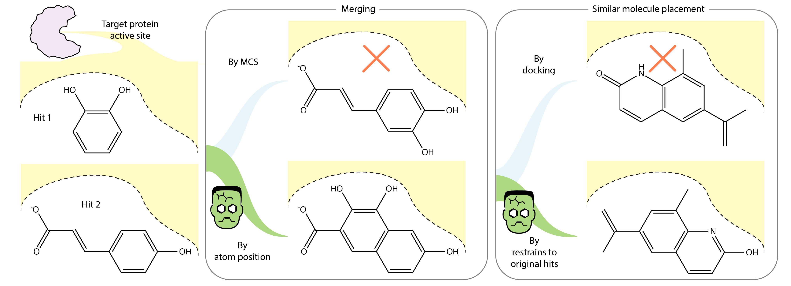
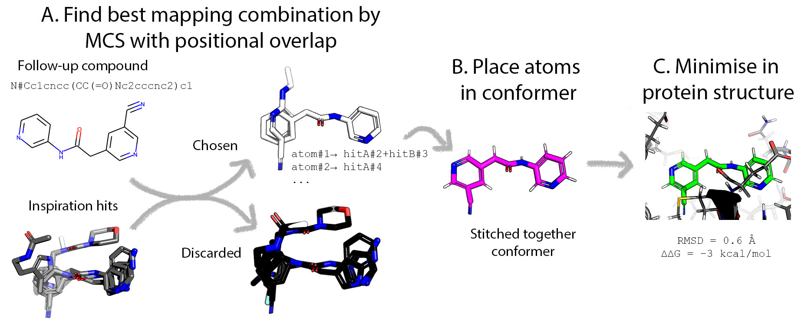
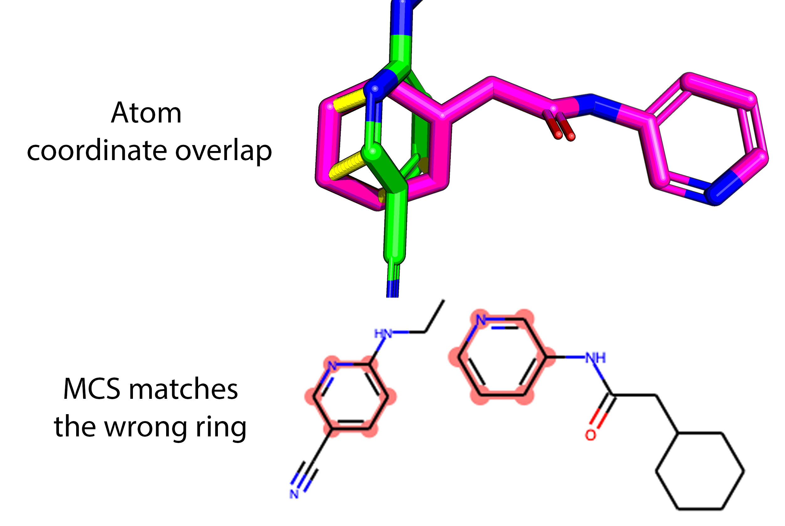
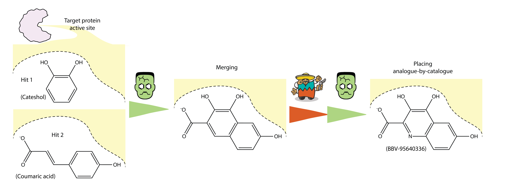

# Fragmenstein
Fragmenstein: Merging, linking and placing compounds by stitching bound compounds together like a reanimated corpse.

[](https://fragmenstein.readthedocs.io/en/latest/?badge=latest)
[](https://github.com/matteoferla/Fragmenstein)
[](https://github.com/matteoferla/Fragmenstein)
[](https://github.com/matteoferla/Fragmenstein)

[](https://github.com/matteoferla/Fragmenstein)
[](https://github.com/matteoferla/Fragmenstein/raw/master/LICENCE)
[](https://github.com/matteoferla/Fragmenstein)
[](https://github.com/matteoferla/Fragmenstein)
[](https://github.com/matteoferla/Fragmenstein)
[](https://github.com/matteoferla/Fragmenstein)

[](https://pypi.org/project/fragmenstein)
[](https://pypi.org/project/fragmenstein)
[](https://pypi.org/project/fragmenstein)
[](https://pypi.org/project/fragmenstein)
[](https://pypi.org/project/fragmenstein)
[](https://pypi.org/project/fragmenstein)

[](https://codeclimate.com/github/matteoferla/Fragmenstein)
[](https://codeclimate.com/github/matteoferla/Fragmenstein)
[](https://codeclimate.com/github/matteoferla/Fragmenstein)

| Name | Colab Link | PyRosetta | Description |
| :--- | :--- | :---: | :--- |
| Pipeline | [](https://colab.research.google.com/github/matteoferla/Fragmenstein/blob/master/colab_fragmenstein.ipynb) | &#10004;| Given a template and a some hits, <br>merge them <br>and place the most similar purchasable analogues from Enamine REAL |
| Light | [](https://colab.research.google.com/github/matteoferla/Fragmenstein/blob/master/colab_playground.ipynb) | &#10060;| Generate molecules and see how they merge<br>and how a placed compound fairs|


Quick links:

* For manuscript data see [manuscript data repository](https://github.com/matteoferla/Fragmenstein-manuscript-data)
* For authors see [Authors](#authors)
* For command line interface see [Command line interface](#command-line-interface)

## Stitched molecules

Fragmenstein can perform two different tasks.

* **Combine** hits
* **Place** a given followup molecule (SMILES) based on series of hits



Like Frankenstein's creation it may violate the laws of chemistry.
Trigonal planar topologies may be tetrahedral, bonds unnaturally long _etc._
This monstrosity is therefore then energy minimised with strong constraints within the protein.

## Classes

There are four main classes —named after characters from the Fragmenstein book and movies:

* `Monster` makes the stitched together molecules indepent of the protein — [documentation](documentation/monster/monster.md)
* `Igor` uses PyRosetta to minimise in the protein the fragmenstein monster followup — [documentation](documentation/igor.md)
* `Victor` is a pipeline that calls the parts, with several features, such as warhead switching —[documentation](documentation/victor.md)
* `Laboratory` does all the combinatorial operations with Victor (specific case)

NB. In the absence of `pyrosetta` (which requires an academic licence), all bar ``Igor`` work and 
alternative Victor classes need to be used, for example 
`Wictor` (RDkit minimisation only), `OpenVictor (using OpenMM).

Additionally, there are a few minor classes.

One of these is ``mRMSD``, a multiple RMSD variant which does not superpose/align and bases which atoms 
to use on coordinates —[documentation](documentation/mrmsd.md)

The class `Walton` performs geometric manipulations of compounds, to set them up to demonstrate
features of Fragmenstein (like captain Walton, it does not partake in the plot, but is key to the narration)

There are two module hosted elsewhere:

* ``Rectifier`` from [molecular_rectifier](https://github.com/matteoferla/molecular_rectifier) is a class that corrects mistakes in the molecule automatically merged by ``Monster``.
* ``Params`` from [rdkit to params module](https://github.com/matteoferla/rdkit_to_params) parameterises the ligands

### Combine
It can also merge and link fragment hits by itself and find the best scoring mergers.
For details about linking see [linking notes](documentation/linking.md).
It uses the same overlapping position clustering, but also has a decent amount of impossible/uncommon chemistry prevention.

Monster:

```python
from fragmenstein import Monster
monster = Monster(hits=[hits_a, hit_b])
monster.combine()
monster.positioned_mol #: RDKit.Chem.Mol
```

Victor:

```python
from fragmenstein import Victor
import pyrosetta
pyrosetta.init( extra_options='-no_optH false -mute all -ex1 -ex2 -ignore_unrecognized_res false -load_PDB_components false -ignore_waters false')

victor = Victor(hits=[hits_a, hit_b], 
                pdb_filename='foo.pdb',  # or pdb_block='ATOM 1 MET ...'
                covalent_resi=1) # if not covalent, just put the first residue or something.
victor.combine()
victor.minimized_mol
```
The PyRosetta init step can be done with the helper function:
```python
Igor.init_pyrosetta()
```

The two seem similar, but Victor places with Monster and minimises with Igor.
As a result it has energy scores

    victor.ddG
    
Fragmenstein is not really a docking algorithm as it does not find the pose with the **lowest energy** 
within a given volume.
Consequently, it is a method to find how **faithful** is a given followup to the hits provided.
Hence the minimised pose should be assessed by the RMSD metric or similar
and the ∆∆G score used solely as a cutoff —lower than zero.

For a large number of combination:

```python
from fragmenstein import Laboratory

lab = Laboratory(pdbblock=pdbblock, covalent_resi=None)
combinations:pd.DataFrame = lab.combine(hits, n_cores=28)
```

### Place
Here is [an interactive example of placed molecules](https://michelanglo.sgc.ox.ac.uk/r/fragmenstein).

It is rather tolerant to erroneous/excessive submissions (by automatically excluding them)
and can energy minimise strained conformations.


Three mapping approaches were tested, but the key is that hits are pairwise mapped to each other by means 
of one-to-one atom matching based upon position as opposed to similarity which is easily led astray. 
For example, note here that the benzene and the pyridine rings overlap, not the two pyridine rings:



### RDkit only and OpenMM

PyRosetta is needed for the pocket-centric minimisation.
Two alternatives are available:

* `Wictor` (without): stops at the RDKit minimisation
* `OpenVictor` (with OpenMM): uses OpenMM to minimise in the protein

Whereas the PyRosetta steps operate via Igor, OpenVictor uses Fritz.
OpenMM is a lot slower than PyRosetta on CPU only,
but is free, open source and potentially more accurate.

Igor is a much larger class as it needs to disable rotamer sampling and other things,
which is not an issue in OpenMM.

A further detail is that openMM is already parallel,
therefore when using with `Laboratory` request only one core.
```python
from fragmenstein import Laboratory, OpenVictor
Laboratory.Victor = OpenVictor
lab = Laboratory(pdbblock=MPro.get_template())
combinations: pd.DataFrame = lab.combine(hits,
                                         n_cores=1,  # 1 core unless $OPENMM_CPU_THREADS is set
                                         timeout=600,  # 2 minutes
                                         combination_size=2,  # pairwise
                                         max_tasks=0)  # 0 is no chunking
```
### Examples

Monster:

```python
from fragmenstein import Monster
monster = Monster(hits=[hits_a, hit_b])
monster.place_smiles('CCO')
monster.positioned_mol
```
    
Victor:

```python
from fragmenstein import Victor, Igor
    Igor.init_pyrosetta()
    victor = Victor(hits=[hits_a, hit_b], pdb_filename='foo.pdb')
    victor.place('CCO')
    victor.minimized_mol
```
    
For a lengthier example see [example notes](documentation/example.md) 
or [documentation](https://fragmenstein.readthedocs.io/en/latest/).

### Demo data

Some demo data is provided in the `demo` submodule.

```python
from fragmenstein.demo import MPro, Mac1

pdbblock: str = Mac1.get_template()
for hitname in Mac1.get_hit_list():
    Mac1.get_hit(hitname)
    ...
```

To use SAR-COV-2 MPro as a test bed, the following may be helpful:

* `fragmenstein.MProVictor`, a derived class (of `Victor`), with various presents specific for MPro.
* `fragemenstein.get_mpro_template()`, returns the PDB block (str) of MPro
* `fragemenstein.get_mpro_molblock(xnumber)`, returns the mol block (str) of a MPro hit from Fragalysis
* `fragemenstein.get_mpro_mol(xnumber)`, as above but returns a `Chem.Mol` instance.

For the matched sets of derivative hits to reference hits see the [manuscript's data repository](https://github.com/matteoferla/Fragmenstein-manuscript-data/blob/main/moonshot/mols/moonshot.json).

## Other features

* [Covalent hits](documentation/covalents.md)
* [Logging](documentation/logging_and_debugging.md)

## Installation

### Fragmenstein and dependencies

Python 3.6 or above. Install from pipy

    python -m pip install fragmenstein

### Requires Pyrosetta

> :warning: PyRosetta no longer runs on CentOS 7 due to old kernel headers (cf. [blog post](https://blog.matteoferla.com/2022/11/glibc-236-vs-centos-7-tale-of-failure.html)).

Pyrosetta requires a password to be downloaded (academic licence) obtained by https://els2.comotion.uw.edu/product/pyrosetta. 
This is a different licence from the Rosetta one. The username of the Rosetta binaries is formatted variant of "academic user", 
while the PyRosetta is the name of a researcher whose name bares an important concept in protein folding,
like boltzmann + constant (but is not that). 
Pyrosetta can be downloaded via a browser from http://www.pyrosetta.org/dow. Or in the terminal via:

    
```bash
curl -u 👾👾👾:👾👾👾https://graylab.jhu.edu/download/PyRosetta4/archive/release/PyRosetta4.Release.python38.linux/PyRosetta4.Release.python38.linux.release-NNN.tar.bz2 -o a.tar.bz2
tar -xf a.tar.bz2
cd PyRosetta4.Release.python38.linux
sudo pip3 install .
```

or using conda

or using `install_pyrosetta` from the `pyrosetta-help` package.

```bash
pip install pyrosetta-help
PYROSETTA_USERNAME=👾👾👾 PYROSETTA_PASSWORD=👾👾👾 install_pyrosetta
```
The `PYROSETTA_USERNAME` and `PYROSETTA_PASSWORD` are environment variables,
which should not be shared publicly (i.e. store them as private environmental variables
in your target application).


## Origin

> See [Fragmenstein and COVID moonshot](documentation/covid.md).

Fragmenstein was created to see how reasonable are the molecules of fragment mergers submitted
in [the COVID moonshot project](https://discuss.postera.ai/c/covid), because after all the underlying method is 
fragment based screening.
[This dataset](https://github.com/postera-ai/COVID_moonshot_submissions) has some unique peculiarities that potentially
are not encountered in other projects.

## Command line interface

The strength of Fragmenstein is as a python module, but there is a command line interface.
This allows different levels of usage.
The top level is the `fragmestein pipeline`, which does the whole thing,
namely it

* place the reference hits against themselves and gets the PLIP interactions
* combines the hits in given combination size, while skipping blacklisted named compounds.
* searches in [SmallWorld](sw.docking.org) the top N mergers
* places them and
* ranks them based on a customisable multiobjective function, which takes into account the PLIP interactions
     along with number of novel atoms (increase in risk & novelty).
 
This in effect reflects the pipeline I commonly use.



usage: fragmenstein pipeline [-h] -t TEMPLATE -i INPUT [-o OUTPUT] [-r RANKING] [-c CUTOFF] [-q QUICK] [-d SW_DIST] [-l SW_LENGTH] [-b SW_DATABASES [SW_DATABASES ...]] [-s SUFFIX]
                             [-n N_CORES] [-m COMBINATION_SIZE] [-k TOP_MERGERS] [-e TIMEOUT] [-x MAX_TASKS] [-z BLACKLIST] [-j WEIGHTS] [-v]

```bash
# `--n_cores` sets number of cores you want to use, this simply is to get the number of cores:
export N_CORES=$(cat /proc/cpuinfo | grep processor | wc -l);

# run
fragmenstein pipeline \
                      --template reference.pdb \
                      --hits filtered.sdf \
                      --n_cores $(($N_CORES - 1)) \
                      --suffix _pairs \
                      --max_tasks 5000 \
                      --sw_databases REAL-Database-22Q1.smi.anon MculeUltimate-20Q2.smi.anon \
                      --combination_size 2 \
                      --timeout 600;
```
* `template`: The template, preferably a polished PDB
* `hits`: The hits in sdf format. These need to have unique names.
* `output`: The output folder
* `suffix`: The suffix for the output files. Note that due to `max_tasks` there will be multiple sequential files for some steps.
* `quick`: Does not reattempt "reanimation" if it failed as the constraints are relaxed more and more the more deviation happens.
* `blacklist`: A file with a lines for each molecule name to not perform (say `hitA–hitZ`)
* `cutoff`: The joining cutoff in Ångström after which linkages will not be attempted (default is 5Å)
* `sw_databases`: See SmallWold or the [SmallWorld API in Python](https://github.com/matteoferla/Python_SmallWorld_API)
    for what datasets are available (e.g. 'Enamine-BB-Stock-Mar2022.smi.anon').
* `sw_length`: How many analogues for each query to keep
* `sw_dist`: The distance cutoff for the SmallWorld search
* `max_tasks`: To avoid memory issues, the pipeline performs a number of tasks (controlled via `max_tasks`)
    before processing them, to disable this use `--max_tasks 0`.
* `weights`: This is a JSON file that controls the ranking


### Specific cases
```bash
fragmenstein monster combine -i hit1.mol hit2.mol >> combo.mol
fragmenstein monster place -i hit1.mol hit2.mol -s 'CCO' >> placed.mol
fragmenstein victor combine -i hit1.mol hit2.mol -t protein.pdb -o output >> combo.mol
fragmenstein victor combine -i hit1.mol hit2.mol -s 'NCO' -n molname -t protein.pdb -o output >> placed.mol
fragmenstein laboratory combine -i hits.sdf -o output -d output.csv -s output.sdf -c 24
```

## Authors

| Author               | Role                    | Homepage                                              | Department                                               | Badges                                                                                                                                                                                                                                                                                                                                                                                                                                                                                                                                                                                                                                                                                                                                                                                                                                                                                                                                                                                                                                                                                                                                                                                                                                                                                                                                                                                                                                            |
|:---------------------|:------------------------|:------------------------------------------------------|:---------------------------------------------------------|:--------------------------------------------------------------------------------------------------------------------------------------------------------------------------------------------------------------------------------------------------------------------------------------------------------------------------------------------------------------------------------------------------------------------------------------------------------------------------------------------------------------------------------------------------------------------------------------------------------------------------------------------------------------------------------------------------------------------------------------------------------------------------------------------------------------------------------------------------------------------------------------------------------------------------------------------------------------------------------------------------------------------------------------------------------------------------------------------------------------------------------------------------------------------------------------------------------------------------------------------------------------------------------------------------------------------------------------------------------------------------------------------------------------------------------------------------|
| Matteo Ferla         | main developer          | [WCHG](https://www.well.ox.ac.uk/people/matteo-ferla) | Wellcome Centre for Human Genetics, University of Oxford | [](https://orcid.org/0000--0002--5508--4673) [](https://scholar.google.com/citations?user=gF--bp_cAAAAJ&hl=en) [](https://twitter.com/matteoferla) [](https://stackoverflow.com/users/4625475) [](https://bioinformatics.stackexchange.com/users/6322) [](https://mailhide.io/e/Ey3RNO2G) [](https://mailhide.io/e/Y1dbgyyE) |
| Rubén Sánchez-Garcia | discussion/code         | Stats                                                 | Department of Statistics, University of Oxford           | [](https://orcid.org/0000--0001--6156--3542) [](https://scholar.google.com/citations?user=MplGOMAAAAJ&hl=en)                                                                                                                                                                                                                                                                                                                                                                                                                                                                                                                                                                                                                                                                                                                                                                                                                                                                                                                                                                                                        |
 | Rachael Skyner      | discussion/editing/code |||
| Stefan Gahbauer      | discussion              |||
| Jenny Taylor         | PI                      | [WCHG](https://www.well.ox.ac.uk/people/jenny-taylor) | Wellcome Centre for Human Genetics, University of Oxford | [](https://orcid.org/0000--0003--3602--5704)                                                                                                                                                                                                                                                                                                                                                                                                                                                                                                                                                                                                                                                                                                                                                                                                                                                                                                                                                                                                                                                                                                                                                                                                                                                |
| Charlotte Deane      | PI                      |||
| Frank von Delft      | PI                      | [CMD](https://www.ndm.ox.ac.uk/team/frank-von-delft)  | Diamond Lightsource / CMD, Oxford                        | [](https://orcid.org/0000--0003--0378--0017) [](https://scholar.google.com/citations?user=uZpTG1kAAAAJ&hl=en) [](https://twitter.com/FrankvonDelft)                                                                                                                                                                                                                                                                                                                                                                                                                                                                                                                                                                                                                                                                                                                                                                                                                                                                                                                                   |
| Brian Marsden        | PI                      | [CMD](https://www.cmd.ox.ac.uk/team/brian-marsden)    | CMD, Oxford                                              | [](https://orcid.org/0000--0002--1937--4091) [](https://scholar.google.com/citations?user=mCPM7bAAAAAJ&hl=en) [](https://twitter.com/bmarsden19)                                                                                                                                                                                                                                                                                                                                                                                                                                                                                                                                                                                                                                                                                                                                                                                                                                                                                                                                                                                               |


## See Also

* ChemRXiv preprint — TBA
* Steph Wills's [fragment network merges repo](https://github.com/stephwills/fragment_network_merges)
    contains useful filtering algorithms
* Fragmenstein is used in Schuller et. al. 2021
    [](https://doi.org/10.1126%2Fsciadv.abf8711)
* Figures for the upcoming manuscript are in a separate
    [repo](https://github.com/matteoferla/Fragmenstein-manuscript-data)
* The conversion of a rdkit Chem.Mol that cannot be sanitised to an analogue that can
    is done by the [molecular rectifier package](https://github.com/matteoferla/molecular_rectifier)
* The conversion of a rdkit Chem.Mol to a PyRosetta residue type (a "params file") is done via
   the [rdkit-to-params package](https://github.com/matteoferla/rdkit_to_params)
* The pipeline demo colab notebook uses Brian Shoichet's [SmallWorld webapp](https://sw.docking.org/),
    interfaced via [its API in Python](https://github.com/matteoferla/Python_SmallWorld_API)
* The playground demo colab notebook features a [JSME widget](https://github.com/matteoferla/JSME_notebook_hack) —
    [JSME](http://www.jcheminf.com/content/5/1/24) is a popular JS only molecular editor
