# Fragmenstein
Scaffold hopping between bound compounds by stitching them together like a reanimated corpse.

> Victor, the pipeline, requires my [rdkit to params module](https://github.com/matteoferla/rdkit_to_params).

## Premise

*Aim*: place a followup compound to the hits as faithfully as possible regardless of the screaming forcefields.
This makes a starting position for any subsequent calculations —say ∆∆G_bound vs. RMSD from the Frangmenstein pose after various optimisation cycles.

## Dramatis personae

There are four main classes:

* ``Fragmenstein`` makes the stitched together molecules —runs without pyrosetta
* ``Egor`` uses PyRosetta to minimise in the protein the fragmenstein followup.
* ``Victor`` runs the show, i.e. is a pipeline, with several features, such as warhead switching.
* ``mRMSD`` is a multiple RMSD variant which does not align and bases which atoms to use on coordinates, not MCS

# Fragmenstein
## Description

Given a RDKit molecule and a series of hits it makes a spatially stitched together version of the initial molecule based on the hits.
Like Frankenstein's creation it violates the laws of chemistry. Planar trigonal topologies may be tetrahedral, bonds unnaturally long _etc._

* `.scaffold` is the combined version of the hits (rdkit.Chem.Mol object).
* `.chimera` is the combined version of the hits, but with differing atoms made to match the followup (rdkit.Chem.Mol object).
* `.positioned_mol` is the desired output (rdkit.Chem.Mol object)

Note, the hits have to be spatially aligned —i.e. extracted from crystal structures in bond form.

`.get_positional_mapping`, which works also as a class method, creates a dictionary of mol_A atom index to mol_B atom index
based on distance (cutoff 2&Aring;) and not MCS.

The code works in two broad steps, first a scaffold is made, which is the combination of the hits (by position).
Then the followup is placed. It is not embedded with constraint embed, which requires the reference molecule to have a valid geometry.
`.scaffold` and `.chimera` and `.positioned_mol` absolutely do not have this.
Novel side chains are added by aligning an optimised conformer against the closest 3-4 reference atoms.
Note that `.initial_mol` is not touched. `.positioned_mol` may have lost some custom properties, but the atom idices are the same.

## Algorithm

The following steps are done:

* `.merge_hits()`: merges the hits, the output `rdkit.Chem.Mol` object added as `.scaffold`.
* `.make_chimera()`: makes the atomic elements in `.scaffold` match those in the followup, the output `rdkit.Chem.Mol` object added as `.chimera`.
* `.place_followup()`  followup is places like the scaffold.

## Merger
The merger of the hits does not use MCS.
Instead all atoms are matched uniquely based on cartesian position with a cutoff of 2 Å (changeable).
The method ``get_positional_mapping`` works as a class method, so can be used for other stuff.
Here are the atoms in x0692 that map to x0305 and vice versa.

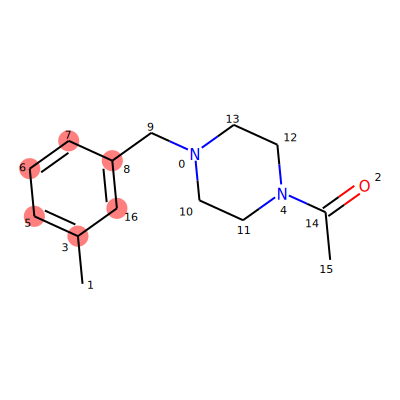
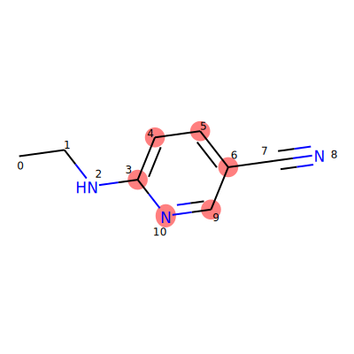

With maximum common substructure, a benzene ring can be mapped 6-ways, here none of that ambiguity is present although different issues arise.
Then the next step is fragment the second molecule to get the bits to add.

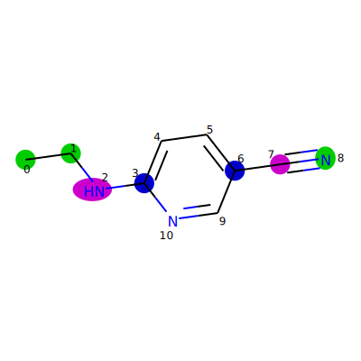
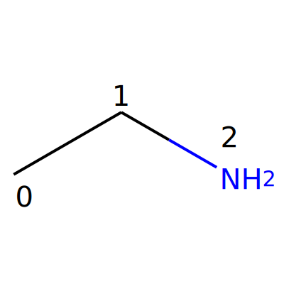
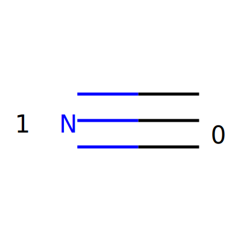

The first fragment when added results in:

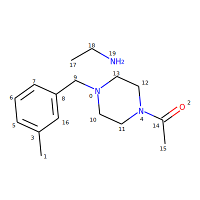
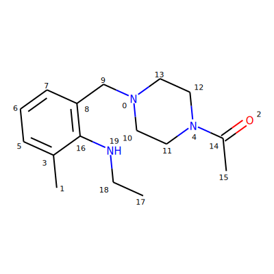

Ditto for the second:

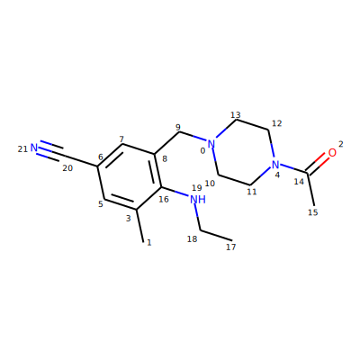

And ditto again for a second fragment (x1249):

## Elemental changes

During the elemental change, valence is taken into account resulting in appropriate positive charge.
This step is needed to avoid weird matches with the followup.

## Placing

To do a contrained embed in RDKit the reference need to have a good geometry. Consequently, this is not possible.
Therefore in the case of sidechains that are novel in the followup a optimised conformer is a aligned against the half placed followup
using the 3-4 atoms that are the closest neighbours within the half-placed structure and the side chain position copied from there for each bit.

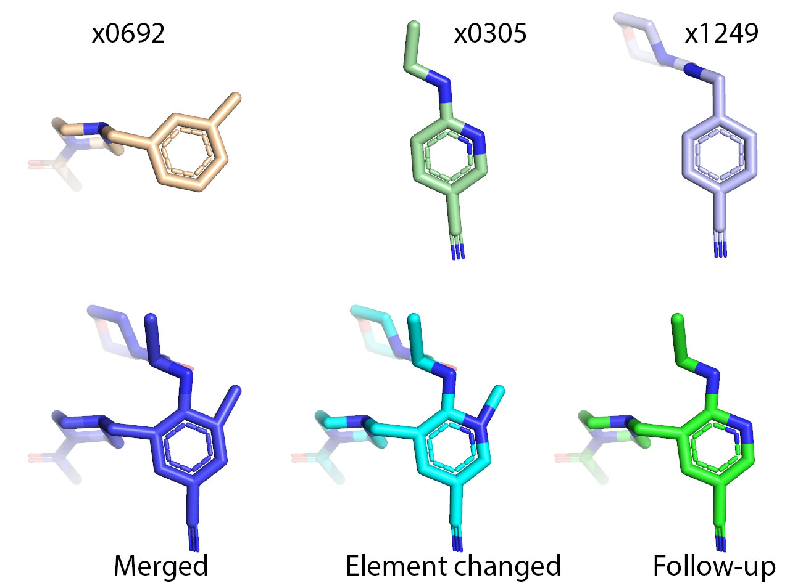
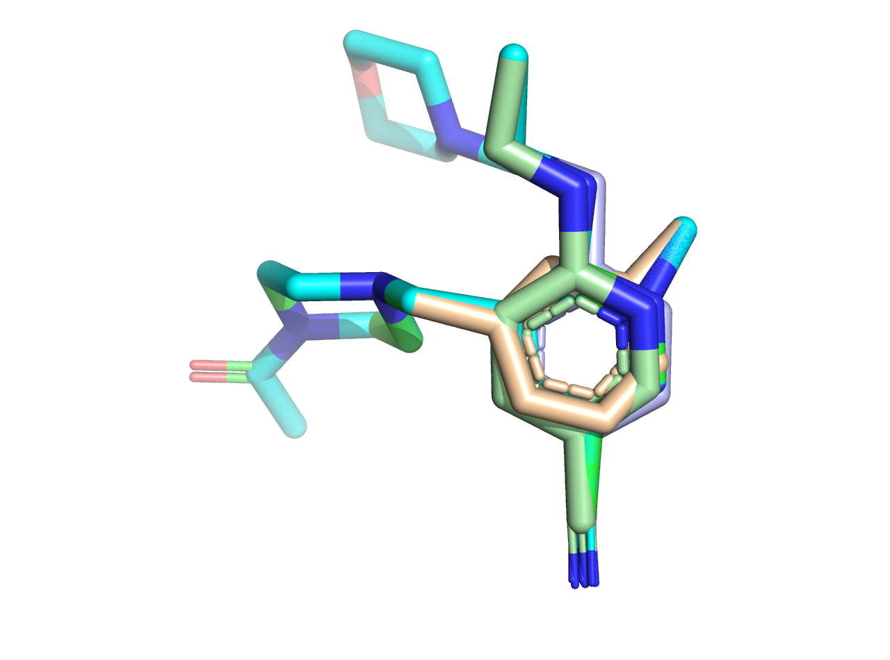

## Example

    hits = [Chem.MolFromMolFile(f'../Mpro/Mpro-{i}_0/Mpro-{i}_0.mol') for i in ('x0692', 'x0305', 'x1249')]
    followup = Chem.MolFromSmiles('CCNc1nc(CCS)c(C#N)cc1CN1C(CCS)CN(C(C)=O)CC1')
    monster = Fragmenstein(followup, hits)
    #monster = Fragmenstein(followup, hits, draw=True) for verbosity in a Jupyter notebook
    monster.make_pse('test.pse')
    
    display(monster.scaffold)
    display(monster.chimera) # merger of hits but with atoms made to match the to-be-aligned mol
    display(monster.positioned_mol) # followup aligned
    
    # further alignments... badly written way of doing this.
    monster.initial_mol = new_mol
    aligned = monster.place_followup(new_mol)
 
## Covalent

If the `Chem.Mol` has a dummy atom (element symbol: `*` within RDKit and smiles, but `R` in a mol file and PDB file) and
a molecule with a single atom is passed to `attachement` argument, then the covalent linker if absent in the hits is anchored
to that atom.
The default dummy atom can be overridden with `Fragmenstein.dummy:Chem.Mol` and `Fragmenstein.dummy_symbol:str`.

## Complicated MCS

Whereas the hit joining is done based on spatial overlaps. The followup is mapped to the blended scaffold by MCS.
First the list of possible MCS with really strict settings are found.
Then a set of mapping is sought which includes one of these by doing a new MCS search but very lax.
And going from very lax in increasing strictness. This prevents some weird mapping.

For more see `get_mcs_mapping`.

## Knows its past

The `Chem.Mol` object will have `Chem.Atom` objects with the RDKit property `_Origin`.
This is a json stringified list of reference hit name dot atom index.
`fragmenstein.origin_from_mol(mol)` will extract these for you.

Also there will be a field,`_StDev`, which is the average of the three axes of 
the standard deviation of the positions of the contributing atoms. `fragmenstein.origin_from_stdev(mol)` extracts them.
    
## Unresolved issues

Here is an example with a few issues.

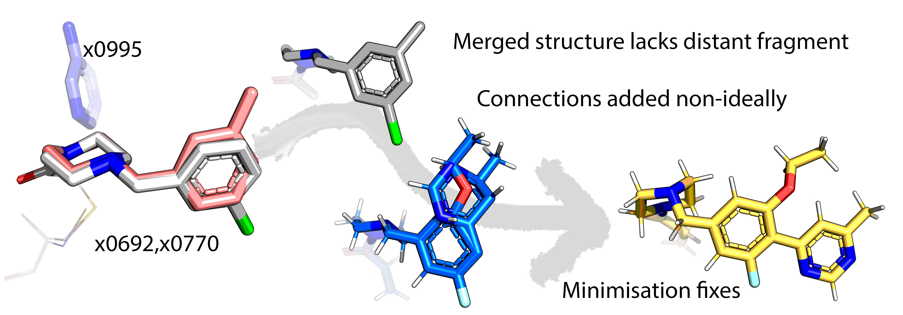

### Non-overlapping fragments

Non-overlapping fragments are discarded. Ideally they should be joined using the followup compound as a template _if possible_.
In the pictured case the SMILES submitted may not have been what was intended and should not be used connect the fragments.

### Imperfect projection

The projection approach is not perfect. The pictured example was affected by a bug (fixed), but this still is a problem in other cases.
This problem is quite apparent in the cases where atoms connecting to the sulfur are added:

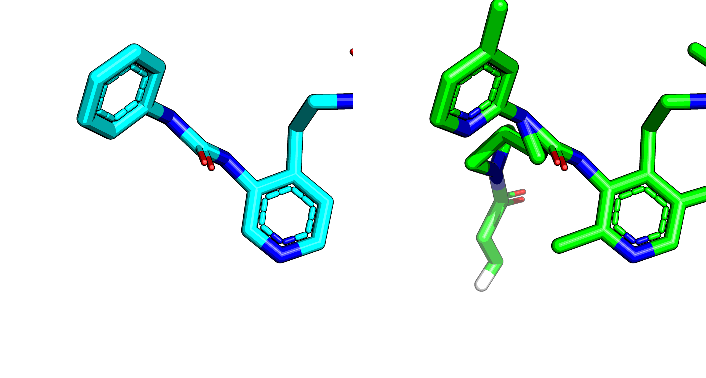

The way the projection is done is via a single conformer.

### More than 4 templates

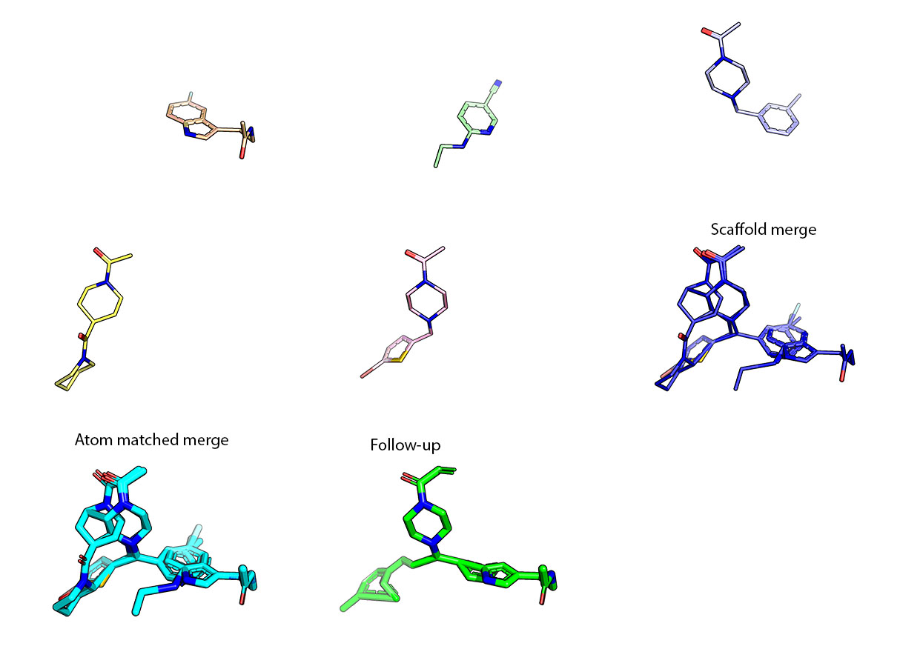

When there are too many templates with large spread, these aren't merged resulting in a spiderweb scaffold.
This results in a non-unique mapping.

# Egor

Egor minimises the Fragmenstein monster in the protein using PyRosetta.

Egor uses the package [rdkit_to_params](https://github.com/matteoferla/rdkit_to_params) to parameterise the compounds.

Egor has three minimisers that I tried:

* a modified cartesian FastRelax which works effectively.
* cartesian MinMover which gets stuck in local minimum in hard cases.
* PertMinMover which behaves weirdly...

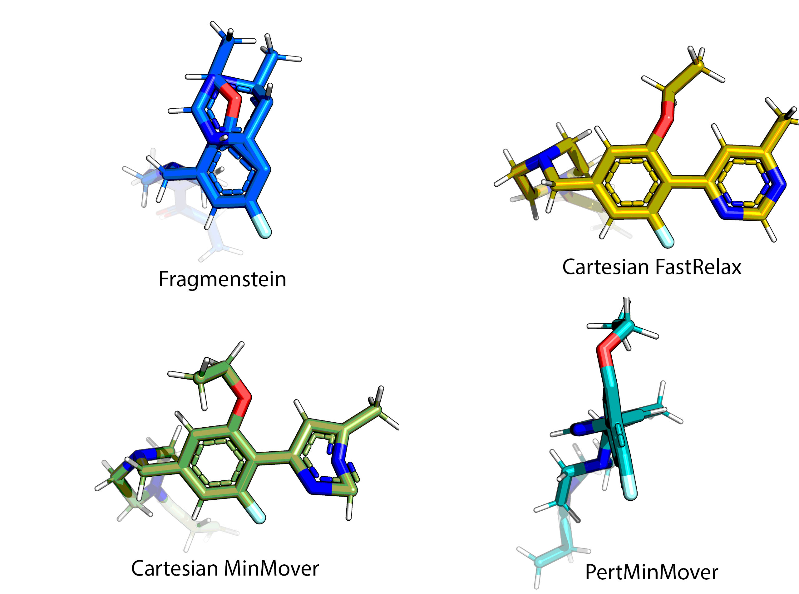

Egor gets run as follows:

    e = Egor(pose, constraint_filename)
    e.minimise(10)

Where pose is a `pyrosetta.Pose` instance.
But Egor can be initialised with `Egor.from_pdbfile(..)` or `Egor.from_pdbblock(..)`.
The latter is nothing more than:

    e.repack_neighbors()
    mover = e.get_FastRelax(10)
    # mover = e.get_PertMinMover()
    # mover = e.get_MinMover()
    mover.apply(e.pose)

Do note that when Victor calls Egor the constraint file used will have the atoms that should be constrained by position.
The `Egor.coordinate_constraint` (default = 1) controls the stringency.
Note that the `get_mod_FastRelax` has a weight in case it runs of constrain to position alone.
The coordinate constraint is a harmonic function of standard deviation 1 plus the atom `_StDev` property
—total math fudge: I am happy to hear better suggestions!

# Victor

Victor is a pipeline class. This has many features and is rather complicated in its setup: but then a point and click
solution that works universally is a bad solution.
Here is a real world usage that uses multiple features:

Import pyrosetta and initialised before everything (applies to Egor too):

    import pyrosetta
    pyrosetta.init(extra_options='-no_optH false -mute all -ignore_unrecognized_res true -load_PDB_components false')
    from fragmenstein import Egor, Fragmenstein, Victor
    import logging, csv, json
    from rdkit import Chem
    from rdkit.Chem import AllChem
    
configure whither to save and whence to load:

    Victor.work_path = '../Mpro_fragmenstein'
    Victor.enable_stdout(logging.WARNING)
    mpro_folder = '/Users/matteo/Coding/rosettaOps/Mpro'  
    
    def get_mol(xnumber):
        mol = Chem.MolFromMolFile(f'{mpro_folder}/Mpro-{xnumber}_0/Mpro-{xnumber}_0.mol')
        mol.SetProp('_Name', xnumber)
        return mol
    
alternatively `Victor.enable_logfile('reanimate.log',logging.DEBUG)`
    
add extra constraints that are warhead & protein specific.
note that the warhead definitions contain preferred names for the connecting atoms and their neighbours

    for cname, con in [('chloroacetamide', 'AtomPair  H  145A  OY  1B HARMONIC 2.1 0.2\n'),
                      ('nitrile', 'AtomPair  H  145A  NX  1B HARMONIC 2.1 0.2\n'),
                      ('acrylamide', 'AtomPair  H  143A  OZ  1B HARMONIC 2.1 0.2\n'),
                      ('vinylsulfonamide', 'AtomPair  H  143A  OZ1 1B HARMONIC 2.1 0.2\n')
                      ]:
        Victor.add_constraint_to_warhead(name=cname, constraint=con)
        
Here is the definition of a nitrile warhead, for example:

    {'name': 'nitrile',
    'covalent': 'C(=N)*',  # zeroth atom is attached to the rest
    'covalent_atomnames': ['CX', 'NX', 'CONN1'],
    'noncovalent': 'C(#N)',  # zeroth atom is attached to the rest
    'noncovalent_atomnames': ['CX', 'NX']
    }
    
The choice of the protein template is a bit weak.
I plan to experiment with minimisation against averaged electron densities.
    
    def get_best(hit_codes):
        return Victor.closest_hit(pdb_filenames=[f'{mpro_folder}/Mpro-{i}_0/Mpro-{i}_0_bound.pdb' for i in hit_codes],
                            target_resi=145,
                            target_chain='A',
                            target_atomname='SG',
                            ligand_resn='LIG')
    
There is a change I require to the pose
    
    def pose_fx(pose):
            pose2pdb = pose.pdb_info().pdb2pose
            r = pose2pdb(res=41, chain='A')
            MutateResidue = pyrosetta.rosetta.protocols.simple_moves.MutateResidue
            MutateResidue(target=r, new_res='HIS').apply(pose)
    
Define all the steps
    
    def reanimate(smiles, name, hit_codes):
        hits = [get_mol(i) for i in hit_codes]
        best_hit = get_best(hit_codes)
        Victor.journal.debug(f'{name} - best hit as starting is {best_hit}')
        apo = best_hit.replace('_bound', '_apo-desolv')
        print(f'reanimate(smiles="{smiles}", name="{name}", hit_codes={hit_codes})')
        reanimator = Victor(smiles=smiles,
                            hits=hits,
                            pdb_filename=apo,
                            long_name=name,
                            ligand_resn='LIG',
                            ligand_resi='1B',
                            covalent_resn='CYS', covalent_resi='145A',
                            extra_constraint='AtomPair  SG  145A  NE2  41A HARMONIC 3.5 0.2\n',
                            pose_fx = pose_fx
                            )
        return reanimator
     
Read the data and do all warhead combinations if covalent. This data is actually from
[github.com/postera-ai/COVID_moonshot_submissions](https://github.com/postera-ai/COVID_moonshot_submissions).
       
    data = csv.DictReader(open('../COVID_moonshot_submissions/covid_submissions_all_info.csv'))
    
    issue = []
    
    for row in data:
        if row['covalent_warhead'] == 'False':
            pass
            reanimate(name = row['CID'], hit_codes = row['fragments'].split(','), smiles=row['SMILES'])
        else:
            print(f'Covalent: {row["CID"]}')
            for category in ('acrylamide', 'chloroacetamide', 'vinylsulfonamide', 'nitrile'):
                if row[category] == 'True':
                    combinations = Victor.make_all_warhead_combinations(row['SMILES'], category)
                    if combinations is None:
                        issue.append(row["CID"])
                        break
                    for c in combinations:
                        reanimate(name = row['CID']+'-'+c, hit_codes = row['fragments'].split(','), smiles=combinations[c])
                    break
            else:
                print(f'What is {row["CID"]}')
                issue.append(row["CID"])
      
The above could have been customised further, by making a class that inherits Victor and defining
 `post_params_step`, `post_fragmenstein_step`, `pose_mod_step` or `post_egor_step`, which are empty methods
intended to make subclassing Victor easier as these are meant to be overridden
—NB `pose_mod_step` is run if not `pose_fx` is given.

# mRMSD

This RDKit requiring module calculate a multiple RMSD variant which does not align and
bases which atoms to use on a given pairing, by default this which atoms were donors in Fragmenstein.

* `mRMSD(followup: Chem.Mol, hits: Sequence[Chem.Mol], mappings: List[List[Tuple[int, int]]])` the mappings is a list of len(hits) containing lists of tuples of atom idx that go from followup to hit
* `mRMSD.from_annotated_mols(annotated_followup: Chem.Mol, hits: Sequence[Chem.Mol])` The annotated variant requires the mol to have the `_Origin` `Chem.Atom` props.
* `mRMSD.from_unannotated_mols(moved_followup: Chem.Mol, hits: Sequence[Chem.Mol], placed_followup: Chem.Mol)` the positional mapping is (re)calculated
* `mRMSD.from_other_annotated_mols(followup: Chem.Mol, hits: Sequence[Chem.Mol], annotated: Chem.Mol)` uses the second case, but `mRMSD.copy_origins(annotated, followup)` is called first.

It is a multiple RMSD, that is basically a N_atom weighted geometric mean of RMSDs.

