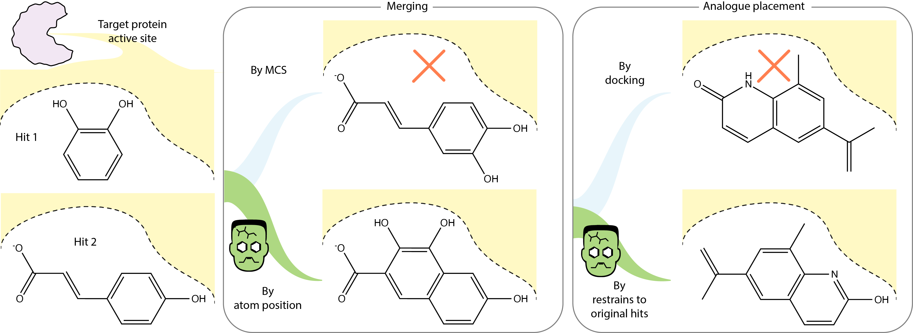

from fragmenstein.laboratory.validator import hits_check

# Fragmenstein

## Stitched molecules
Fragmenstein: Merging, linking and placing compounds by stitching bound compounds together like a reanimated corpse.

Fragmenstein can perform two different tasks:

* **Combine** hits (merging and linking) based on their atomic overlap
* **Place** a given followup molecule based on one or more parent hits

NB. Whereas docking uses pre-generates comformers and finds the best pose that best matches the parent (if set-up to do so),
Fragmenstein creates a monstrous comformer from the parent(s) and then minimises it, optionally in the protein.
Hence why I call it a 'placement' not docking tool.

## Index

* [Installation](documentation/installation.md)
* [Theory](documentation/workings.md)
* [Command line usage](documentation/cmd.md)
* [Python usage](documentation/usage.md)
* [Examples](documentation/examples.md)
* [Limitations](documentation/limitations.md)
* [Manuscript data repository](https://github.com/matteoferla/Fragmenstein-manuscript-data)
* [Paper Authors](documentation/authors.md)
* [FAQ](documentation/FAQ.md)

## Badges and notebooks

Example of multiple applications: 

| Name                   | Colab Link                                                                                                                                                                                                     | PyRosetta | Description |
|:-----------------------|:---------------------------------------------------------------------------------------------------------------------------------------------------------------------------------------------------------------| :---: | :--- |
| Light                  |   | &#10060;| Generate molecules and see how they merge and how a placed compound fairs|
| Pipeline w/o Pyrosetta |  | &#10060;| Given a template and a some hits,  merge them  and place the most similar purchasable analogues from Enamine REAL |
| Pipeline w/ PyRosetta  |  | &#10004;| Given a template and a some hits,  merge them  and place the most similar purchasable analogues from Enamine REAL |

## See Also

* ChemRXiv preprint — https://chemrxiv.org/engage/chemrxiv/article-details/65d751ab9138d23161b7ea38
* Fragmenstein is used in Schuller et. al. 2021
    
* Figures for the upcoming manuscript are in a separate
    [repo](https://github.com/matteoferla/Fragmenstein-manuscript-data)
* The conversion of a rdkit Chem.Mol that cannot be sanitised to an analogue that can
    is done by the [molecular rectifier package](https://github.com/matteoferla/molecular_rectifier)
* The conversion of a rdkit Chem.Mol to a PyRosetta residue type (a "params file") is done via
   the [rdkit-to-params package](https://github.com/matteoferla/rdkit_to_params)
* The pipeline demo colab notebook uses Brian Shoichet's [SmallWorld webapp](https://sw.docking.org/),
    interfaced via [its API in Python](https://github.com/matteoferla/Python_SmallWorld_API)
* The playground demo colab notebook features a [JSME widget](https://github.com/matteoferla/JSME_notebook_hack) —
    [JSME](http://www.jcheminf.com/content/5/1/24) is a popular JS only molecular editor
* [Molecular Rectifier](https://github.com/matteoferla/molecular_rectifier) is used to correct the mistakes in the merged molecules,
   and is usable for other algorithms, especially de novo design via denoising diffusion probabilistic models
  (cf [blogpost discussion for the latter](https://www.blopig.com/blog/2024/09/out-of-the-box-rdkit-valid-is-an-imperfect-metric-a-review-of-the-kekulizeexception-and-nitrogen-protonation-to-correct-this/))
* Fragmenstein combine route does not check if a compound is purchasable. Above NextMove Software SmallWorld is used
  ([SmallWorld hosted by John Irwin](sw.docking.org)) to find the top N analogues,
  via [an API](https://github.com/matteoferla/Python_SmallWorld_API).
* In [Arthorian Quest](https://github.com/matteoferla/Arthorian-Quest), a parent combound is coverted with ease into an ambiguous SMARTS pattern, 
  catalogue compounds are searched with NextMove Software's Arthor ([hosted by John Irwin](arthor.docking.org)) and then placed with Fragmenstein.
* Steph Wills's [fragment network merges repo](https://github.com/stephwills/fragment_network_merges)
    enumerates superstructures of two parent hits from catalogue and places them with Fragmenstein.
* [SynDirElla](https://github.com/kate-fie/syndirella) performs a retrosynthesis of a compound, enumerates close analogues of the synthons and places their combinations
