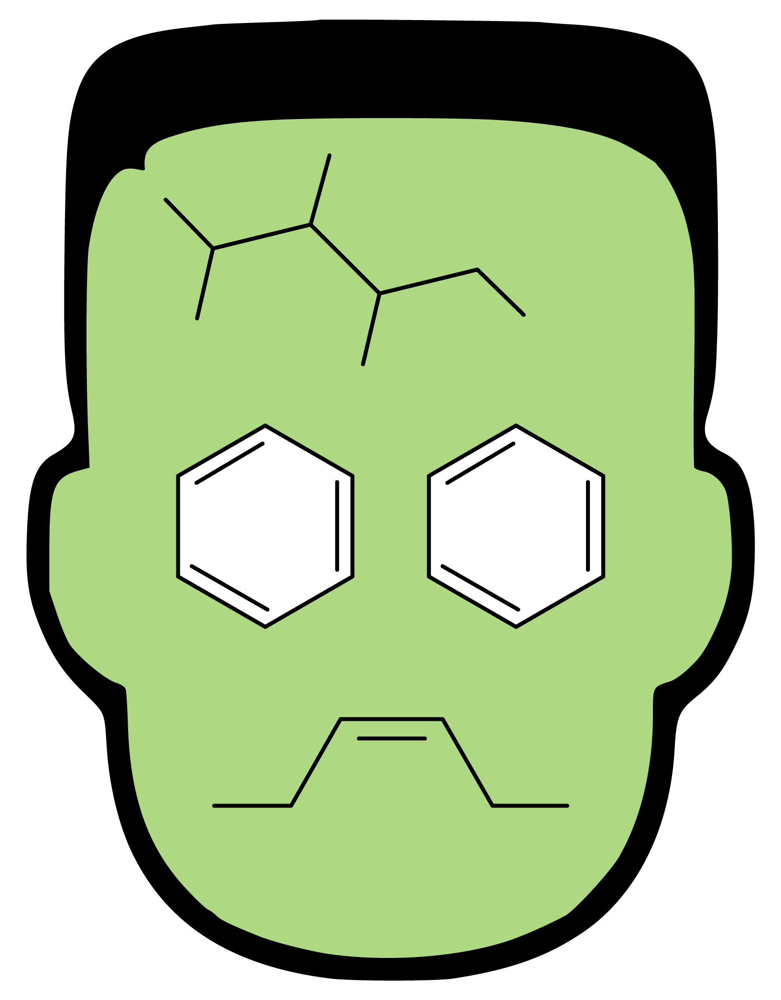

## Colour

> This is not relevant to users. It is just a note for the colour for styling.

The logo:

Uses the colour: **#AED882**, which has hue 90º (=chartreuse), 40% saturation and 85% brightness.
This colour is very similar to feijoa (#a5d785) and is a brighter version of pistachio (#93c572, 96º, 41%, 77%).
`YellowGreen` is the closest web colour (80º, 61%, 50%).

