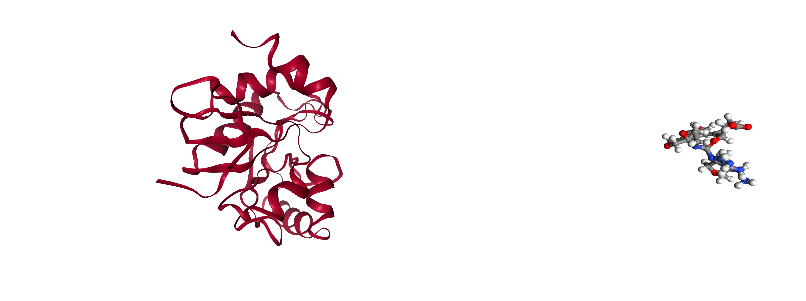

# Examples
Place a SMILES pattern according to one or more parent hits with `Monster` (no minimisation).

```python
from fragmenstein import Monster
from typing import Sequence

hits: Sequence[Chem.Mol] = ...
smiles : str = 'CCO'
monster = Monster(hits=hits)
monster.place_smiles(smiles)
monster.positioned_mol
```

Victor:

```python
from fragmenstein import Victor, Igor

hits: Sequence[Chem.Mol] = ...
smiles : str = 'CCO'
Igor.init_pyrosetta()
victor = Victor(hits=hits, pdb_filename='foo.pdb')
victor.place('CCO')
victor.minimized_mol
```

For a lengthier example see [example notes](documentation/example.md) 
or [documentation](https://fragmenstein.readthedocs.io/en/latest/).

### Demo data

Some demo data is provided in the `demo` submodule.

```python
from fragmenstein.demo import MPro, Mac1

pdbblock: str = Mac1.get_template()
hitname: str = ...
for hitname in Mac1.get_hit_list():
Mac1.get_hit(hitname)
...
```

To use SAR-COV-2 MPro as a test bed, the following may be helpful:

* `fragmenstein.MProVictor`, a derived class (of `Victor`), with various presents specific for MPro.
* `fragemenstein.get_mpro_template()`, returns the PDB block (str) of MPro
* `fragemenstein.get_mpro_molblock(xnumber)`, returns the mol block (str) of a MPro hit from Fragalysis
* `fragemenstein.get_mpro_mol(xnumber)`, as above but returns a `Chem.Mol` instance.

For the matched sets of derivative hits to reference hits see the [manuscript's data repository](https://github.com/matteoferla/Fragmenstein-manuscript-data/blob/main/moonshot/mols/moonshot.json).


## Config
Victor is the main entrypoint to the module.

```python
from fragmenstein import Victor
```

### Logging
set logging to stdout
```python
import logging
Victor.enable_stdout(logging.INFO)
```

or to file
```python
import logging
Victor.enable_logfile('test.log', logging.INFO)
```

the Logger instance is `Victor.journal`, and it captures rdkit and pyrosetta logs 
if `enable_stdout` or `enable_logfile` are called with the argument `capture` set to `True` (default)
or the method `capture_logs` is called directly.

### Pyrosetta

Pyrosetta needs to be initialised as normal

```python
import pyrosetta
pyrosetta.init(extra_options='-no_optH false -mute all -ignore_unrecognized_res false -load_PDB_components false')
```
The `ignore_unrecognized_res` controls whether to raise an error if a residue can be loaded.
While `load_PDB_components` stop the PDB defined database from being loaded,
which is handy as it prevents weird errors (e.g. there is a [PDB ligand called `LIG`](https://www.rcsb.org/ligand/LIG))

Alternatively, a cleaner way can be using a helper function in
the [pyrosetta-help module](https://github.com/matteoferla/pyrosetta_help)

```python
import pyrosetta
from pyrosetta_help import make_option_string
extras = make_option_string(no_optH=False,
                            mute='all',
                            ignore_unrecognized_res=False,
                            load_PDB_components=False)
pyrosetta.init(extra_options=extras)
```

If you want to just use `Monster` and do not have `pyrosetta` installed for licencing reasons,
the following works fine.

```python
from fragmenstein import Monster
```

If you have pyrosetta installed, but want to mimic this behaviour (??)

```python
import sys
sys.modules['pyrosetta'] = None
# this raises on `import pyrosetta` a ModuleNotFoundError
```
### Output path

set working path
```python
Victor.work_path = 'test'
```
### Hits

Create mol files of reference hits
given a single PDB file return the RDKit Chem.Mol molecule with covalent as `*`

```python
mol = Victor.extract_mol(name='x01234',
                         filepath='here.pdb',
                         smiles='CCO',
                         ligand_resn='LIG',
                         removeHs=False)
```

To parse a whole folder (flat) of PDBs and get a dictionary of names -> Chem.Mol
```python
mols = Victor.extract_mols(folder='PDBs',
                           smilesdex={'x01234': 'CCO'}, # optional
                           ligand_resn= 'LIG',
                           regex_name='x(\d+)', # optional regex to run get rid of fluff
                           proximityBonding=False, # change this to True if you lack CONECT entries (disconnected ligand)
                           )
```

To have a gander
```python
from rdkit import Chem
Chem.Draw.MolsToGridImage(mols.values())
```
                           
NB. there is a Victor method called `from_files`, 
this is for restarting a run precariously from the saves and has nothing to do with these.

NB2. One thing to be vigilant for is that the ligands are in superposed/aligned protein.
Fragmenstein does nothing to ensure this is true as multichain protein etc. make everything harder and
it does not require much effort at all to fix (see Troubleshooting).

## Template
Like in a docking experiment, the template protein conformer is important
even if sidechains and backbones can move.
To minimise with Pyrosetta, it is best to minimise a ligand bond protein and remove the ligand
afterwards.

The ligand needs to be parameterised first. Example
(for more see [rdkit_to_params](https://github.com/matteoferla/rdkit_to_params))

```python
from rdkit_to_params import Params

params = Params.from_smiles_w_pdbfile(pdb_file='5BV6_clean.pdb',
                              smiles='c1nc2c(n1[C@H]3[C@@H]([C@H]4[C@H](O3)CO[P@@](=O)(O4)[O-])O)N=C(NC2=O)N',
                            name='35G')
params.dump('35G.params')
```
Have a gander to see all is good
```python
import nglview
nglview.show_rosetta(params.test())
```
Load pose:
```python
from typing import *


def get_pose(pdb_filename: str,
             params_filenames: Optional[List[str]]) -> pyrosetta.Pose:
    """A fxn to load a pose, with a list of params"""
    pose = pyrosetta.Pose()
    if params_filenames and isinstance(params_filenames, pyrosetta.rosetta.utility.vector1_string):
        pyrosetta.generate_nonstandard_residue_set(pose, params_filenames)
    if params_filenames and isinstance(params_filenames, list):
        params_filenames2 = pyrosetta.rosetta.utility.vector1_string()
        params_filenames2.extend(params_filenames)
        pyrosetta.generate_nonstandard_residue_set(pose, params_filenames2)
    else:
        pass
    pyrosetta.rosetta.core.import_pose.pose_from_file(pose, pdb_filename)
    return pose


pose = get_pose(pdb_filename='5BV6_clean.pdb',
             params_filenames=['35G.params'])
```
Igor has a function to relax against ED (taken from [here](http://blog.matteoferla.com/2020/04/how-to-set-up-electron-density.html))

```python
from fragmenstein import Igor
Igor.relax_with_ED(pose, 'map.ccp4')
pose.dump_pdb('relaxed.pdb')
pyrosetta.rosetta.core.pose.remove_nonprotein_residues(pose)
pose.dump_pdb('template.pdb')
```
## Merge

Victor has two modes, merge and place.
Say we extracted `hit_a` and `hit_b` as `Chem.Mol` instances:

```python
victor = Victor(hits=[hits_a, hit_b], pdb_filename='template.pdb')
# victor.place('CCO') # to place.
victor.combine()
victor.minimised_mol
```
Using code from [here](http://blog.matteoferla.com/2021/02/multiple-poses-in-nglview.html)
one could inspect the starting hits in NGLView in the notebook etc.

Alternatively,
```python
victor.make_pse()
```
One could see the numbers with:
```python
victor.summarize()
```

Or individual values

```python
victor.ddG
```

## Troubleshooting

### Ligand not in template

If the ligand is not in the template, then the ∆∆G will be zero.
This often happens **when the template was energy minimised, but was not re-aligned to the original pose**,
and as a result it drifted away from the ligand.

Doing a 'redocking' placement is always a sane way to start (place a compound based on itself).
For a small XChem hit, 
we are talking about -5 kcal/mol circa.

### Too many results

The ∆∆G (kcal/mol) is not that you would get if the compound were in the spot in with the energy minimum (as in docking).
It is nearby there, hopefully. But can be used for reducing the list of results.
Given that linking two indole-sized compounds is already in the 250-300 dalton range, 
sorting by ligand efficiency (ratio of ∆∆G over number of heavy atoms) is best (good: 0.4 kcal/mol/HA upwards)

### Inspect
To see the Pyrosetta pose
```python
import nglview as nv

view = nv.show_rosetta(victor.igor.pose)
view
```
If there is something like this:

Then it means that the PDB where the molecule was extracted is in a different from the template.
To fix, before extracting or before using a template align them in say PyMOL (`align` command).
Just remember than PyMOL strips LINK entries making covalents non-covalent
(unless `proximityBonding=True` is used in the extraction, which is not recommended).
Doing it within python:
```python
import pymol2

with pymol2.PyMOL() as pymol:
    pymol.cmd.load('minimized.pdb', 'mini')
    pymol.cmd.load('x01234_refined.pdb', 'hit')
    pymol.cmd.align('mini', 'hit and chain A')
    pymol.cmd.save('moved.pdb', 'mini')
```

### Protonation

The SMILES provided needs to be given formal charges to match the protonation at pH 7.
Namely,

* `*C(=O)O` will yield a carboxylic acid, while `*C(=O)[O-]` a carboxylate (conjugate base).
* `*N` will yield a base (`*[NH2]`), while `*[N+]` or `*[NH3+]`, will yield the conjugate acid.
* `*OP(=O)(O)O` will yield phosphoric acid `*OP(=O)([OH])[OH]`, while `*OP(=O)([O-])[O-]` will yield a phosphate.

There are modules and tools to correct the protonation at pH 7. Also, there are several paper suggesting isosteres.

### Hydrogen in hits
Another issue may arise when hydrogens are present in the hits somehow.

If the calculations fail along a step the compounds can be inspected, but these are not `victor.minimised_mol`

If an error happens polishing up the minimised molecule from pyrosetta:

```python
ligand = victor.igor.mol_from_pose()
from rdkit import Chem
from rdkit.Chem import AllChem
AllChem.Compute2DCoords(ligand)
ligand = AllChem.RemoveAllHs(ligand)
ligand
```

If the error happens during Igor, but Monster worked fine, the ligand is in `victor.monster.positioned_mol`.
Additionally if the issue is with one of the atoms and the indices are required there is a debug focused method in Monster:

```python
mol = victor.monster.positioned_mol
victor.monster.draw_nicely(mol)
```
### That is taken!
If either the ligand name `ligand_resn` (default: `LIG`) or the `ligand_resi` (default `1B`)
appear in the template it will fail. 

    ValueError: Residue 20A already exists in structure

If the issue slipped through, 
say Igor is being accessed manually, an error like `Atom 'C1 0' not found`. This is because the constraint
file has the residue number as a PDB number (`1B`), which gets converted internally to the pose number
and pose number 0 means it does not exist.
Therefore make sure to there are no shared names or specify a free name/index.

```python
victor = Victor(hits=[atp], pdb_filename='1ATP_apo.pdb',
                ligand_resi='1Z', ligand_resn='ATP'
               )
```

There are a few residue names that should not be taken. Such as PTMs, `ACE` etc.
Additionally, I don't know why but the residue name cannot be `XXX` (which is expected to be an amino acid).

### Equal solutions
If the solution is not ideal, you may want to check other equally valid solutions, 
which are stored in `monster.mol_options`.

## Advanced

### Warheads

See [covalents](covalents.md)

### Monster

A problem is that the combined molecules may not be enamine purchasable.
So the placed molecule could be a purchaseable.
So getting a positioned mol

```python
from fragmenstein import Monster
from rdkit import Chem

monster = Monster(hits=[hits_a, hit_b])
monster.combine()
smiles = Chem.MolToSmiles(monster.positioned_mol)
```

Using [enamine-real-search API](https://github.com/xchem/enamine-real-search)

```python
from search import EnamineSession

session = EnamineSession()
similarity_results = session.similarity_search(smiles=smiles, threshold=0.1)
```

```python

victor = Victor(hits=[hits_a, hit_b], pdb_filename='template.pdb')
victor.place(similarity_results.smiles) # to place.
```

## Michelanglo
To make an interactive page in [Michelanglo](https://michelanglo.sgc.ox.ac.uk/), like [this example](https://michelanglo.sgc.ox.ac.uk/r/fragmenstein).
one can use the [michelanglo_api](https://github.com/matteoferla/MichelaNGLo-api) (pip name is `michelanglo-api`).
The data is stored in a github repo. For a detailed example see [pipeline](pipeline.md).

First, make sure to keep the results of the operations

```python

data = []

data.append({**victor.summarise(), 'mol': victor.minimised_mol})
```

Then make a table of the results
```python
from rdkit.Chem import PandasTools
import pandas as pd

scores = pd.DataFrame(data)
```

then make or get a Michelanglo page
```python
from michelanglo_api import MikeAPI
mike = MikeAPI('username', 'password')
page = mike.convert_pdb('6WOJ') # make new
# or...
#p = mike.get_page('xxxxxxxx')  # retrieve old
page.retrieve()
page.show_link()
```
Fix up... etc.
```python
page.description = 'Hello world. '
page.loadfun = ''
page.columns_viewport = 6
page.columns_text = 6
```
Add the data to the page and GitHub:
```python
gitfolder='/Users/you/path_to_your_github_repo_on_your_machine'
folder = 'folder_name_within_repo'
targetfolder=f'{gitfolder}/{folder}'
# make a smaller table and json store it
scores['filename'] = page.pandas_to_mols(scores, targetfolder)
headers = ['filename', 'regarded', '∆∆G', 'comRMSD']
mini = scores.loc[~scores.filename.isna()][headers]  # filename None has some issue.
mini.to_json(f'{targetfolder}/data.json')
# make a table
page.make_fragment_table(metadata=dict(zip(headers, ['name', 'used hits', '∆∆G', 'RMSD'],
               username='matteoferla',
               repo_name='Data_for_own_Michelanglo_pages',
               foldername=folder,
               protein_sele='145:A', # show this on protein. NGL selection
               sort_col=2, #sort by column index 2. ∆∆G
               sort_dir='asc', #asc or desc
               template_row=-1, # is the template a file called `template.pdb` (-1) or a filename in the row n?
               fragment_row=1, # the inspiration fragments (-1 for none). The names must match with or without a .mol.
               jsonfile='data.json')
# commit changes with github
page.commit()
```
### Waters
In addition to extracting a hit, the extract_mol code can work with waters.

```python
hit = Victor.extract_mol(name='x1234',
                         smiles='CCCC',
                         filepath='path/filename.pdb',
                         ligand_resn = 'LIG')

waters = Victor.extract_mol(name='water',
                 filepath='path/filename.pdb',
                 ligand_resn = 'HOH')
```
This waters molecule will have disconnected waters.
These can be combined as a single object (`hits=[hit, waters]`) or split up (`hits=[hit, *waters]`) with

```python
waters = Chem.GetMolFrags(waters, asMols=True, sanitizeFrags=False)
```
One thing to note is that it may be best to use `joining_cutoff=3` and the `keep_all=False`


