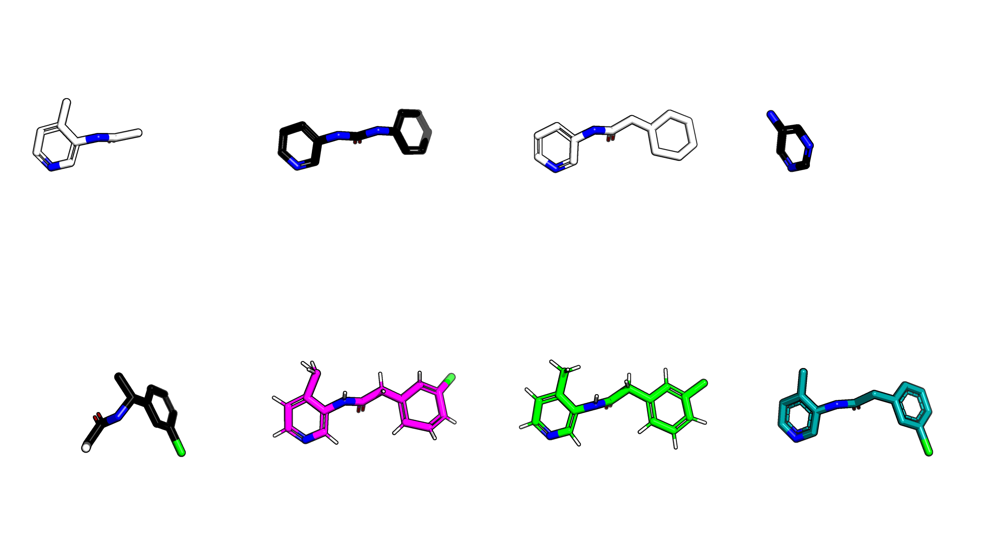

## TRY-UNI-714a760b-6

In the placement of a user submitted compound an issue occurs sometimes, wherein the code gets confused.
`TRY-UNI-714a760b-6` is such a case.

    victor = MProVictor.from_hit_codes(smiles='Cc1ccncc1NC(=O)Cc1cccc(Cl)c1',
                                               hit_codes=['x0107','x0434','x0678','x0995','x1382'],
                                               long_name='TRY-UNI-714a760b-6')
    actual = MProVictor.get_mol('x2646')
    victor.make_pse(extra_mols=[actual])
    rmsd = victor.validate(reference_mol=actual)
    
The human chose

* the methylpyridine off x0107
* the benzene-pyridine off x0434, but wanted an amide not a ureido
* the link between the rings as amide x0678
* x0995 is a red herring (this is a big problem with the postera dataset see [covid.md](../covid.md))
* benzene with a chroride from x1382

The only way to resolve it is to run it strict on the discard (which increases the strikes of `Unmerge` to 20).

    Victor.monster_throw_on_discard = True
    victor = MProVictor.from_hit_codes(smiles='Cc1ccncc1NC(=O)Cc1cccc(Cl)c1',
                                       #hit_codes=['x0107','x0434','x0678','x0995','x1382'],
                                       hit_codes=['x0107' ,'x0434', 'x1382'],
                                       long_name='TRY-UNI-714a760b-6')

This works. However, it required a human to chuck out the red herring.

