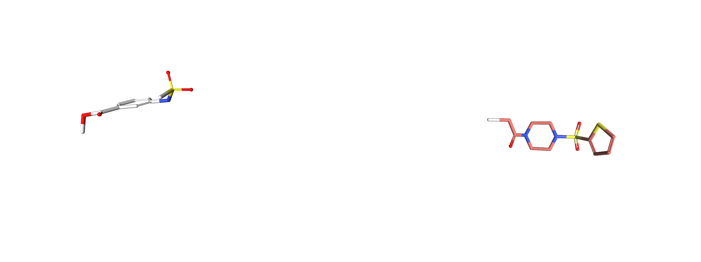
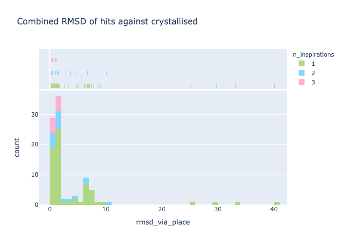
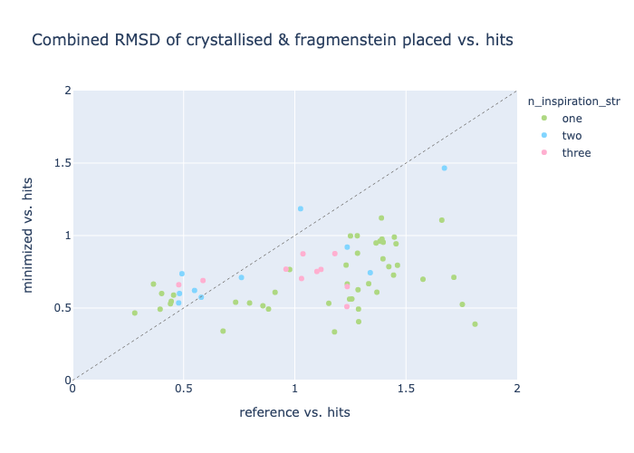
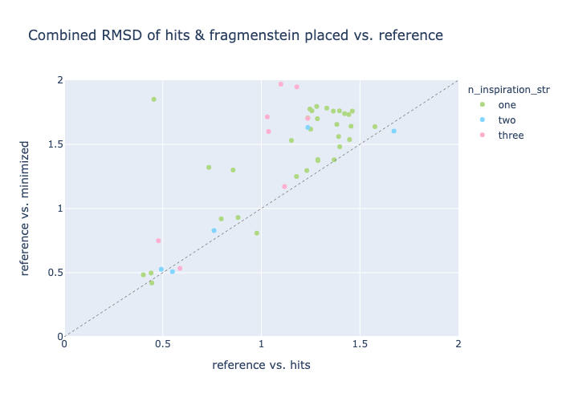

## Manual filtering of Moonshot fragments

Unfortunately the Covid moonshot site was made quickly and some issue became apparent only afterwards.
One of these is the problem that users submitted multiple compounds with a single set of inspirations
as opposed one set for each compound.

As a results all sorts of incorrect inspirations were present and in some case large unneccesary sets,
which slows down Fragmenstein exponentially.

Herein is the code I used to inspect each one in a Jupyter notebook.

### Data import
```python3
import sys
from typing import *
if sys.version_info < (3, 8):
    from typing_extensions import TypedDict, Literal, overload
from rdkit import Chem
from rdkit.Chem import AllChem
import pandas as pd
from fragmenstein import mpro_data
import ipywidgets as widgets
from IPython.display import display, HTML, Markdown

postera :pd.DataFrame = mpro_data.fetch_postera()
```

There are two similar keys, `Structure ID` and `structure_ID`. Are they different?

```python3
postera.loc[(postera['Structure ID'] != postera.structure_ID) &
           ~postera.structure_ID.isna()]\
[['CID', 'Structure ID', 'structure_ID']]
```

No. Only, "MAK-UNK-6435e6c2-2" differs with "x2779" vs. "x1418".

### Clean table

```python3
nice_keys = ['structure_ID', 'SMILES','CID','category', 'rationale',
       'Submission Notes',
             'fragments','inspired_by',
             'MADE','ASSAYED']
crystallised = postera.loc[~postera.structure_ID.isna()]
validity : 'pd.Series[bool]'= ~crystallised.fragments.isna() & (crystallised.fragments != 'x0072')
valid_crystallised = crystallised.loc[validity]
valid_crystallised[nice_keys]
```

### Split the fragments

```python3
import warnings
from functools import partial

comma_split = partial(str.split, sep=',')
with warnings.catch_warnings(): # shut up with your SettingWithCopyWarning
    warnings.simplefilter("ignore")
    valid_crystallised['frag_list'] = valid_crystallised.fragments.apply(comma_split)
valid_crystallised = valid_crystallised.reset_index(drop=True)
```
### Display functions

Copy pasted from https://blog.matteoferla.com/2021/02/multiple-poses-in-nglview.html

```python3
import nglview as nv
from rdkit import Chem
from io import StringIO
from typing import *
from warnings import warn

view = nv.NGLWidget()

def get_ggplot_colour_scale(n:int=7) -> Iterable[NewType('ColorHex', str)]:
    ggplot_color_scales = {1: ['#F8766D'],
                           2: ['#F8766D', '#00B4C4'],
                           3: ['#F8766D', '#00BA38', '#619CFF'],
                           4: ['#F8766D', '#7CAE00', '#00BFC4', '#C77CFF'],
                           7: ['#F8766D', '#C49A00','#53B400','#00C094','#00B6EB','#A58AFF','#FB61D7']
                           }
    if n in ggplot_color_scales:
        return iter(ggplot_color_scales[n])
    else:
        return iter(ggplot_color_scales[7])
      
def add_mol(view: nv.NGLWidget, mol: Chem.Mol, color: str, n: Optional[int]=None) -> int:
    if n is None:
        n = view.n_components
    fh = StringIO(Chem.MolToMolBlock(mol))
    view.add_component(fh, ext='mol')
    view.clear_representations(component=n)
    view.add_licorice(colorValue=color, component=n, multipleBond='symmetric')
    return n
 
def crete_multiple_view(*mols: Chem.Mol) -> nv.NGLWidget:
    if len(mols) == 1 and isinstance(mols[0], Sequence):
        warn('Expected each `Chem.Mol` as an argument, got  `Sequence[Chem.Mol]`')
        mols = mols[0]
    colors = get_ggplot_colour_scale(len(mols))
    view = nv.NGLWidget()
    for n, mol in enumerate(mols):
        add_mol(view, mol, color=next(colors), n=n)
    return view

def show_colors(*hit_names: str) -> None:
    if len(hit_names) == 1 and isinstance(hit_names[0], Sequence):
        warn('Expected each `str` as an argument, got  `Sequence[str]`')
        hit_names = hit_names[0]
    from IPython.display import display, HTML
    template = '<span style="color: {1}">{0}</span>'
    zipped = zip(hit_names, get_ggplot_colour_scale(len(hit_names)))
    spans = [template.format(name, color) for name, color in zipped]
    display(HTML(' '.join(spans)))
```

### Iteration

define iterator:

```python3
choices = {}
crystal_iterator = valid_crystallised.iterrows()
```

Iterate by running this cell over and over:
```python3
i, row = next(crystal_iterator)

display(widgets.FloatProgress(value=len(choices), min=0.0, max=len(valid_crystallised)))
display(Markdown(f'## {row.CID} ({row.category})\n{row.creator}\n\n{row.rationale}\n\n{row["Submission Notes"]}'))
frags = set(row.frag_list) - {'x1420', 'x11641', 'x11557', 'x11276', 'x11532', 'x11540'}
if len(frags) == 1:
    choices[row.CID] = list(frags)
    print(f'Autoaccepted {frags}')
    grid = None
else:
    # Checkbox is hard to press but ToggleButton do not tollerate html descriptions...
    grid = widgets.GridBox([widgets.ToggleButton(description=name) for name in row.frag_list],
                           layout=widgets.Layout(grid_template_columns="repeat(3, 200px)")
                           )
    display(grid)
show_colors(*row.frag_list)
target_mol = mpro_data.get_mol(row.structure_ID)
# show target 2d depiction
copy = Chem.Mol(target_mol)
AllChem.Compute2DCoords(copy)
display(copy)
# show 3d of all hits
view = crete_multiple_view(*list(map(mpro_data.get_mol, frags)))
add_mol(view, target_mol, color='white', n=len(frags))
# for i in range(len(row.frag_list)+1):
#     view.remove_ball_and_stick(component=i)
view
```
If there were multiple run this after each of above.
In hindsign it should have been part of the above as only 3 times corrections were made.
```python
chosen = [child.description for child in grid.children if child.value]
print(row.CID)
if chosen:
    pass
elif 'x0434' in frags:
    chosen = 'x0434'
elif 'x0387' in frags:
    chosen = 'x0387'
print(chosen)
choices[row.CID] = chosen
print(f'{len(choices)} done, {len(valid_crystallised) - len(choices)} to go')
```

## Result

Several things stood out.

### Resuse
Many cases consisted of using the x0434 or x0387 backbones and taking an atom from different sources.
In reality I could have simply filtered like that and saved myself an afternoon.

The most fruitful hits were:
```python3
from functools import reduce

valid_inspirations : Set[str] = reduce(set.union, valid_crystallised.frag_list.values, set())
valid_tally = {v: sum(valid_crystallised.frag_list.apply(lambda l: v in l)) for v in valid_inspirations}
# pretty sure there's an operator call for this:
valid_tally = dict(sorted(valid_tally.items(), key=lambda kv: kv[1], reverse=True))
valid_tally
```

* x0678: 51
* x0434: 45
* x0107: 17
* x0305: 15
* x0995: 14
* x0104: 14
* x1382: 13
* x0387: 11
* x0689: 10
* x1093: 10

These are:


I assume as more submissions were crystallised the more results focused on a particular series.
Unfortunately, I cannot see a column that acts as a submission timestamp.

### Road paved in good intentions

User submitted compounds crystalise, but not as intended.



_White is crystallised submission, others are the "inspirations"_

Generally this is more subtle, i.e. a group crystallises incorrectly.


_White is crystallised submission, others are the "inspirations"_

### Cartesian naïveté

An interesting case comes from 'WAR-XCH-72a8c209-5', which was created by BRICS decomposition.
This method is useful for fragmenting the hits and merging with Fragmenstein.
In this case however, different parts were merged by not in the way intended.


_White is crystallised submission, others are the "inspirations"_

## Data

| cid                 | crystal   | inspiration_hits   |
|:--------------------|:----------|:-------------------|
| DAR-DIA-23aa0b97-6  | x10178    | x0305,x0434        |
| DAR-DIA-23aa0b97-13 | x2964     | x0104,x0434,x0995  |
| DAR-DIA-23aa0b97-14 | x10996    | x0104,x0434,x0995  |
| DAR-DIA-23aa0b97-17 | x2569     | x0305,x0434        |
| DAR-DIA-23aa0b97-20 | x2563     | x0434,x1093        |
| DAR-DIA-842b4336-3  | x2608     | x0434              |
| DAR-DIA-842b4336-13 | x2643     | x0434              |
| WAR-XCH-eb7b662f-7  | x10996    | x0305,x0434        |
| TRY-UNI-714a760b-3  | x11317    | x0434,x0995,x1382  |
| TRY-UNI-714a760b-6  | x2646     | x0107,x0434,x1382  |
| TRY-UNI-714a760b-12 | x2908     | x0107,x0434,x1382  |
| TRY-UNI-714a760b-16 | x11044    | x0107,x0434,x1382  |
| TRY-UNI-714a760b-18 | x2649     | x0107,x0434,x1382  |
| TRY-UNI-714a760b-19 | x11318    | x0107,x0434,x0995  |
| TRY-UNI-714a760b-20 | x2572     | x0107,x0434        |
| TRY-UNI-714a760b-22 | x2912     | x0107,x0434,x0678  |
| ADA-UNI-f8e79267-2  | x10889    | x0072,x0387,x0678  |
| JOR-UNI-2fc98d0b-6  | x10237    | x0387,x0434        |
| JOR-UNI-2fc98d0b-7  | x10996    | x0434              |
| JOR-UNI-2fc98d0b-12 | x10236    | x0387,x0434        |
| DUN-NEW-f8ce3686-14 | x10049    | x0072,x1458        |
| DUN-NEW-f8ce3686-23 | x10899    | x0072,x1458        |
| DUN-NEW-f8ce3686-24 | x10506    | x1458              |
| ANN-UNI-26382800-5  | x2600     | x0434,x1249        |
| DAR-DIA-eace69ff-36 | x3351     | x0104              |
| NIR-THE-c331be7a-2  | x10678    | x0305,x1420        |
| NIR-THE-c331be7a-6  | x10513    | x1420              |
| MAK-UNK-6435e6c2-1  | x0689     | x0689              |
| MAK-UNK-6435e6c2-2  | x2779     | x0689              |
| MAK-UNK-6435e6c2-3  | x1386     | x0689              |
| MAK-UNK-6435e6c2-4  | x1384     | x0689              |
| MAK-UNK-6435e6c2-5  | x0691     | x0689              |
| MAK-UNK-6435e6c2-6  | x0755     | x0689              |
| MAK-UNK-6435e6c2-7  | x0478     | x0689              |
| MAK-UNK-6435e6c2-8  | x0107     | x0689              |
| MAK-UNK-6435e6c2-9  | x0464     | x0689              |
| PET-SGC-a8a902d9-1  | x11225    | x0107,x0387        |
| ALV-UNI-7ff1a6f9-47 | x2581     | x0434              |
| GAB-REV-70cc3ca5-4  | x10019    | x0107              |
| GAB-REV-70cc3ca5-8  | x3080     | x0107              |
| GAB-REV-70cc3ca5-13 | x3108     | x0107              |
| GAB-REV-70cc3ca5-18 | x3366     | x0107              |
| ALE-HEI-f28a35b5-9  | x0678     | x0434              |
| BAR-COM-4e090d3a-39 | x2562     | x0434              |
| BAR-COM-4e090d3a-47 | x3305     | x0434              |
| BAR-COM-4e090d3a-49 | x2764     | x0434              |
| BAR-COM-4e090d3a-57 | x3298     | x0434              |
| BEN-DND-031a96cc-8  | x10022    | x0434              |
| FRA-FAC-9ed5a63a-1  | x0678     | x0395              |
| MAK-UNK-0d6072ac-4  | x2659     | x0749              |
| WAR-XCH-72a8c209-5  | x10728    | x1493              |
| JAN-GHE-83b26c96-1  | x10329    | x0678              |
| JAN-GHE-83b26c96-2  | x11372    | x0678              |
| JAN-GHE-83b26c96-3  | x10377    | x0678              |
| JAN-GHE-83b26c96-8  | x10423    | x0678              |
| JAN-GHE-83b26c96-9  | x10327    | x0678              |
| JAN-GHE-83b26c96-10 | x10395    | x0678              |
| JAN-GHE-83b26c96-11 | x10248    | x0678              |
| JAN-GHE-83b26c96-12 | x11368    | x0678              |
| JAN-GHE-83b26c96-13 | x10565    | x0678              |
| JAN-GHE-83b26c96-14 | x10247    | x0678              |
| JAN-GHE-83b26c96-15 | x11041    | x0678              |
| JAN-GHE-83b26c96-19 | x10996    | x0678              |
| JAN-GHE-83b26c96-20 | x10392    | x0678              |
| JAN-GHE-83b26c96-21 | x10606    | x0678              |
| JAN-GHE-83b26c96-22 | x10422    | x0678              |
| JAN-GHE-83b26c96-23 | x10396    | x0678              |
| MAT-POS-7dfc56d9-1  | x0161     | x0161              |
| TRY-UNI-2eddb1ff-1  | x10314    | x0387,x0678        |
| TRY-UNI-2eddb1ff-2  | x10723    | x0387,x1382        |
| TRY-UNI-2eddb1ff-3  | x10900    | x0104,x0387        |
| TRY-UNI-2eddb1ff-7  | x10789    | x0387              |
| JAN-GHE-5a013bed-2  | x10466    | x0678              |
| JAN-GHE-5a013bed-4  | x10604    | x0678              |
| EDG-MED-0da5ad92-1  | x11041    | x0434              |
| EDG-MED-0da5ad92-2  | x10201    | x0434              |
| EDG-MED-0da5ad92-5  | x11557    | x0434              |
| EDG-MED-0da5ad92-7  | x11562    | x0434              |
| EDG-MED-0da5ad92-8  | x10723    | x0434              |
| EDG-MED-0da5ad92-10 | x10422    | x0434              |
| EDG-MED-0da5ad92-11 | x10392    | x0434              |
| EDG-MED-0da5ad92-12 | x10976    | x0434              |
| EDG-MED-0da5ad92-15 | x11485    | x0434              |
| EDG-MED-0da5ad92-16 | x11013    | x0434              |
| EDG-MED-0da5ad92-18 | x10494    | x0434              |
| EDG-MED-0da5ad92-21 | x11025    | x0434              |
| BRU-LEF-c49414a7-1  | x10756    | x0107,x0434        |
| EDJ-MED-49816e9b-1  | x11011    | x0434,x0678        |
| EDJ-MED-49816e9b-2  | x10334    | x0434,x0678        |
| RAL-MED-2de63afb-1  | x10371    | x1493              |
| RAL-MED-2de63afb-2  | x10322    | x1493              |
| RAL-MED-2de63afb-14 | x10387    | x1493              |
| NAU-LAT-445f63e5-6  | x10800    | x0434              |
| EDJ-MED-78f964c8-1  | x3303     | x0678              |
| EDJ-MED-6af13d92-1  | x11313    | x0678              |
| EDJ-MED-6af13d92-2  | x11276    | x0678              |
| EDJ-MED-6af13d92-3  | x11294    | x0678              |
| MIC-UNK-66895286-1  | x11532    | x0678              |
| MIC-UNK-66895286-3  | x11540    | x0678              |
| MIC-UNK-deda7a44-5  | x11186    | x0434              |

## Distribution

These were scored with Fragmenstein.

```python3
# import Safeguard (see gist)
import requests
raw_gist_url = 'https://gist.githubusercontent.com/matteoferla/24d9a319d05773ae219dd678a3aa11be/raw/983a0cfdbc410e30ea1325368eb700f6166493a5/safeguard.py'
response : requests.Response = requests.get(raw_gist_url)
response.raise_for_status()
exec(response.text)

# validate
@Safeguard
def get_victor_validation(row: pd.Series) -> Victor:
    # cid	crystal	inspiration_hits
    victor = MProVictor.from_hit_codes(row.inspiration_hits.split(','), category=row.category)
    smiles = mpro_data.get_mol(row.crystal)
    victor.place(smiles=row.SMILES, long_name=row.cid)
    return victor.validate(mpro_data.get_mol(row.crystal))

from fragmenstein import MProVictor, Victor, mpro_data, mRMSD
get_victor_validation.error_value = {}
calcs = results.apply(get_victor_validation, axis=1)
# done sequentially as there are few of them:
results = pd.concat([results, pd.DataFrame(calcs.to_list())], axis=1)

# read ddG
from fragmenstein import MProVictor
import json, os

def get_folder(cid: str) -> str:
    path = os.path.join(MProVictor.work_path, cid)
    if os.path.exists(path):
        return path
    else:
        raise FileNotFoundError(cid)

def get_data(row: pd.DataFrame) -> Dict[str, Any]:
    path = os.path.join(get_folder(row.cid), f'{row.cid}.minimised.json')
    with open(path) as fh:
        return json.load(fh)
 
@Safeguard
def get_ddG(row: pd.DataFrame) -> float:
    return get_data(row)['Energy']['xyz_∆∆G']

results['ddG'] = results.apply(get_ddG, axis='columns')

def get_heavy_count(smiles: str) -> int:
    return Chem.MolFromSmiles(smiles).GetNumHeavyAtoms()

results['num_heavy_atoms'] = results.SMILES.apply(get_heavy_count)
results['LE'] = results.ddG / results.num_heavy_atoms

# make categorical the lazy way.
import inflect
ie = inflect.engine()

results['n_inspiration_str'] = results.n_inspirations.apply(ie.number_to_words)
```
Now how do the references (crystals) compare:
```python3
import plotly.express as px
import numpy as np
from fragmenstein.branding import divergent_colors

n_colors :int = results['n_inspirations'].max()

fig = px.histogram(results.sort_values('n_inspirations'), x="reference2hits_rmsd", 
                   marginal="rug",
                   hover_data=['cid'],
                   nbins=50,
                   color='n_inspirations',
                  title='Combined RMSD of hits against crystallised',
                  color_discrete_sequence=divergent_colors[n_colors],
                  )
fig.write_image("rmsd_crystallised_distribution.png")
fig.show()
```


## How about against the minimised?

```python3
import plotly.express as px

results['sanitised_minimized2hits_rmsd'] = results.minimized2hits_rmsd.fillna(5)

n_colors :int = results['n_inspirations'].max()
fig = px.scatter(results.sort_values('n_inspirations'), 
                 x="reference2hits_rmsd",
                 y="minimized2hits_rmsd",
                 hover_data=['cid', 'ddG', 'LE'],
                 color='n_inspiration_str',
                 title='Combined RMSD of crystallised & fragmenstein placed vs. hits',
                 #size='LE_shifted',
                 color_discrete_sequence=divergent_colors[n_colors],)
fig.add_shape(type="line",
    x0=0, y0=0, x1=20, y1=20,
    line=dict(
        color='grey',
        width=1,
        dash="dot",
    )
)
fig.update_layout(xaxis=dict(range=[0,2], title='reference vs. hits'),
                  yaxis=dict(range=[0,2], title='minimized vs. hits'))

fig.write_image("rmsd_vs_hits.png")
fig
```

Basically, the Fragmenstein minimised molecule is more faithful to the inspirations than the crystal.

```python3
n_colors :int = results['n_inspirations'].max()
fig = px.scatter(results.sort_values('n_inspirations'), 
                 x="reference2hits_rmsd",
                 y="reference2minimized_rmsd",
                 hover_data=['cid', 'ddG', 'LE'],
                 color='n_inspiration_str',
                 title='Combined RMSD of hits & fragmenstein placed vs. reference',
                 #size='LE_shifted',
                 color_discrete_sequence=divergent_colors[n_colors],)
fig.add_shape(type="line",
    x0=0, y0=0, x1=20, y1=20,
    line=dict(
        color='grey',
        width=1,
        dash="dot",
    )
)
fig.update_layout(xaxis=dict(range=[0,2], title='reference vs. hits'),
                  yaxis=dict(range=[0,2], title='reference vs. minimized'))

fig.write_image("rmsd_vs_reference.png")
fig
```

