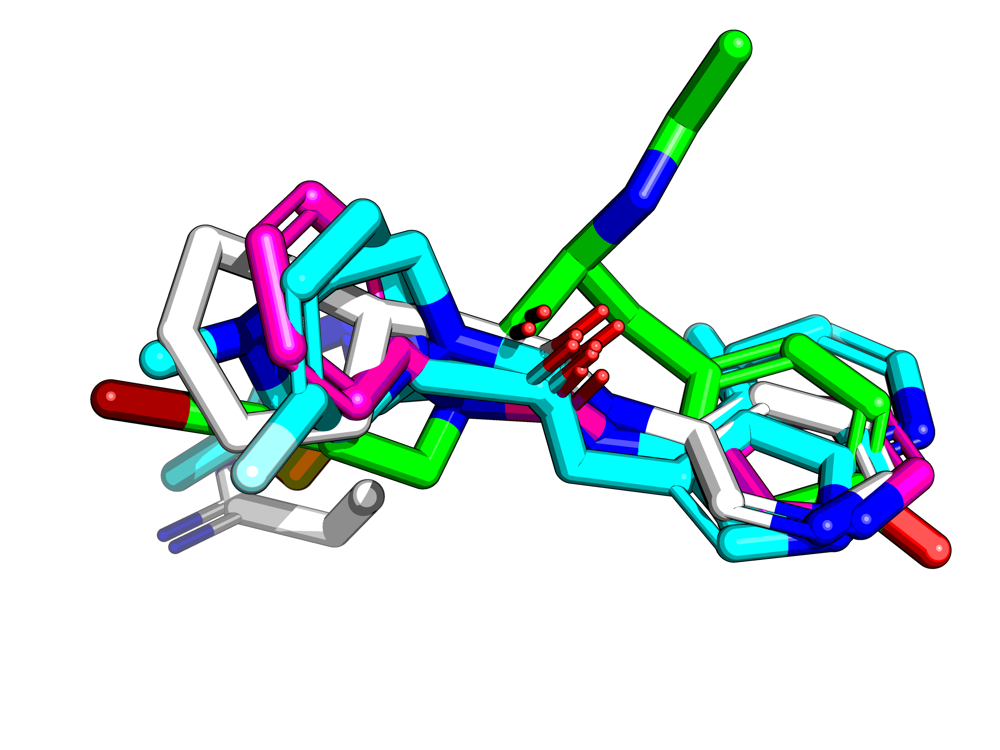

## Removing the ones that do not map equally

So as a test case, let's get an even more extreme case, `ALE-HEI-f28a35b5-17` which has 8 hits listed,
but in reality only x0107 and x1093 are required. The rest is just noise.
Given three hits, the atoms maps can be A -> B -> C = A -> C ...or not.
What happens when the most fragments that are most disruptive are removed?

    from fragmenstein import Fragmenstein
    import itertools
    from collections import Counter
    from rdkit import Chem
    
    class Þragmenstein(Fragmenstein): # mocked class.
        def __init__(self, hits):
            self.hits = hits
            self._debug_draw = False
    
    
    mpro_folder = '/Users/matteo/Coding/Mpro'
    
    def get_mol(xnumber):
        xnumber = xnumber.strip()
        mol = Chem.MolFromMolFile(f'{mpro_folder}/Mpro-{xnumber}_0/Mpro-{xnumber}_0.mol')
        mol.SetProp('_Name', xnumber)
        return mol
    
    # using the inspiration hits from ALE-HEI-f28a35b5-17
    hit_codes = ['x0107', 'x0395', 'x0434', 'x0678', 'x0967', 'x0991', 'x1093']
    hits = [get_mol(h) for h in hit_codes]
    þ = Þragmenstein(hits)
    
    ## Dodginess removal approach
     
    def get_dodgies(skippers):
        dodgy = []
        for hit0, hit1, hit2 in itertools.combinations(þ.hits, 3):
            hn0 = hit0.GetProp('_Name')
            hn1 = hit1.GetProp('_Name')
            hn2 = hit2.GetProp('_Name')
            if any([hit in skippers for hit in (hn0, hn1, hn2)]):
                continue
            for a, b in m[(hn0, hn1)].items():
                if a in m[(hn0, hn2)] and b in m[(hn1, hn2)]:
                    if m[(hn0, hn2)][a] != m[(hn1, hn2)][b]:
                        dodgy.extend((hn0, hn1, hn2))
                        #print(f'{hn0}.{a} - {hn1}.{b} : {hn2}.{m[(hn0, hn2)][a]} - {hn2}.{m[(hn1, hn2)][b]}')
        d = Counter(dodgy).most_common()
        if dodgy:
            return get_dodgies(skippers=skippers+[d[0][0]])
        else:
            return skippers
         
    for distance in (0.6, 1, 2, 5, 10):
        m = {}
        for h1, h2 in itertools.combinations(þ.hits, 2):
            m[(h1.GetProp('_Name'), h2.GetProp('_Name'))] = þ.get_positional_mapping(h1, h2, distance)
    
        print(distance, get_dodgies([]))

Gives

    Å Troublemakers
    0.6 ['x0434']
    1 ['x0434', 'x0967']
    2 ['x1093', 'x0395', 'x0107', 'x0434']
    5 ['x1093', 'x0395', 'x0967', 'x0107']
    10 ['x0395', 'x1093', 'x0967', 'x0434']
    

    
x1093 and x0107 are removed at 2 Å due to the ring.
Consequently, the code implemented to get rid of dodgy mappings does not include rings.
However, for a more realiable, solution, the rings need to be collapsed.