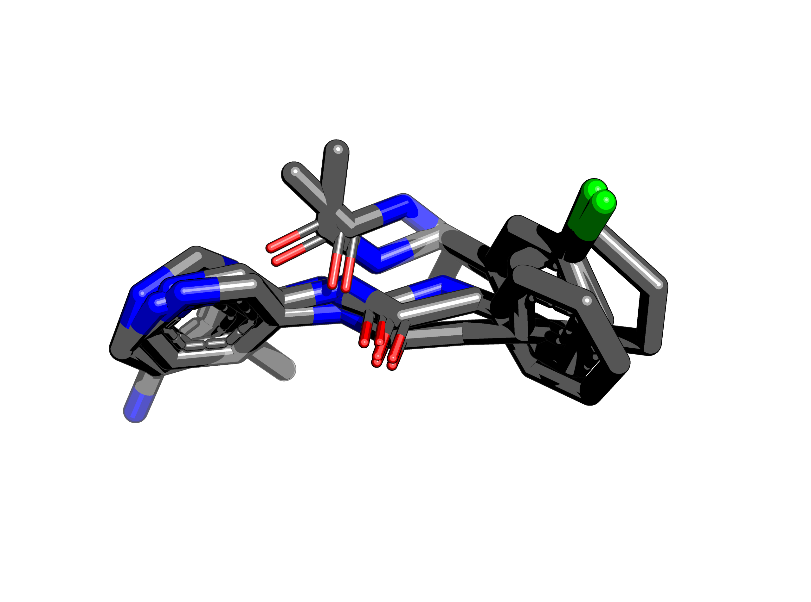
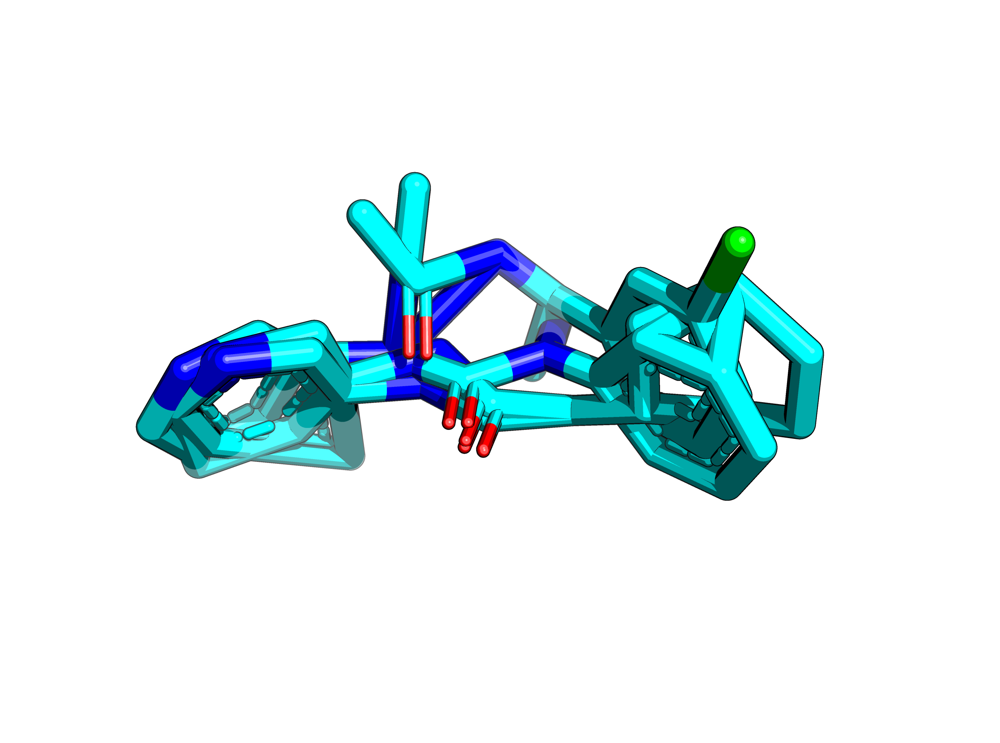
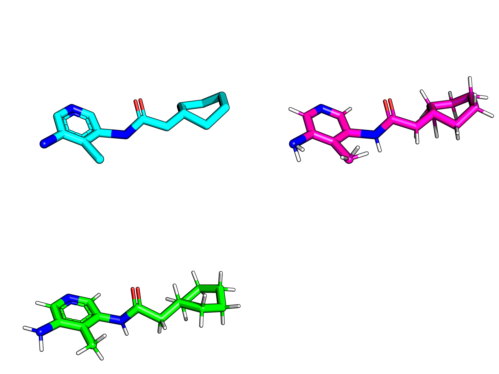
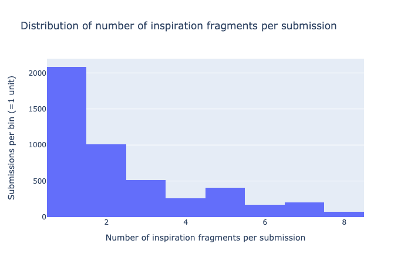

## Over-inspired problem

Fragmenstein works well for two

> This is very much a COVID19 moonshot unique problem. Namely, the cases of excess inspiration fragments.

The 'TRY-UNI-714a760b-1' compound (`Cc1c(N)cncc1NC(=O)CC1CCCCC1`) is purposed to be inspired by x0107, x0434, x0678, x0748, x0995, x1382.

This takes forever to make a template... which comes out awful.

When placed and minimised the compound drifts off. The reason for this is that there are only two atoms that map.

In reality only x0107, x0678, x0995 were the true inspirations. When this is corrected, the scaffold is basically the followup.

So the question is: how does one fix this?
Before that it is best to see how frequent this is:

Of the 2,000 with 1 hit as inspiration, 500 are based upon x0072.
These are not really inspirations, just a case where `null` was not a choice.

The wobbly extras are good to set deviations for the coordinate constraints.

## Removing the ones that do not map equally

So as a test case, let's get an even more extreme case, `ALE-HEI-f28a35b5-17` which has 8 hits listed,
but in reality only x0107 and x1093 are required. The rest is just noise.
Given three hits, the atoms maps can be A -> B -> C = A -> C ...or not.
What happens when the most fragments that are most disruptive are removed?

    from fragmenstein import Fragmenstein
    import itertools
    from collections import Counter
    from rdkit import Chem
    
    class Þragmenstein(Fragmenstein): # mocked class.
        def __init__(self, hits):
            self.hits = hits
            self._debug_draw = False
    
    
    mpro_folder = '/Users/matteo/Coding/Mpro'
    
    def get_mol(xnumber):
        xnumber = xnumber.strip()
        mol = Chem.MolFromMolFile(f'{mpro_folder}/Mpro-{xnumber}_0/Mpro-{xnumber}_0.mol')
        mol.SetProp('_Name', xnumber)
        return mol
    
    # using the inspiration hits from ALE-HEI-f28a35b5-17
    hit_codes = ['x0107', 'x0395', 'x0434', 'x0678', 'x0967', 'x0991', 'x1093']
    hits = [get_mol(h) for h in hit_codes]
    þ = Þragmenstein(hits)
    
    ## Dodginess removal approach
     
    def get_dodgies(skippers):
        dodgy = []
        for hit0, hit1, hit2 in itertools.combinations(þ.hits, 3):
            hn0 = hit0.GetProp('_Name')
            hn1 = hit1.GetProp('_Name')
            hn2 = hit2.GetProp('_Name')
            if any([hit in skippers for hit in (hn0, hn1, hn2)]):
                continue
            for a, b in m[(hn0, hn1)].items():
                if a in m[(hn0, hn2)] and b in m[(hn1, hn2)]:
                    if m[(hn0, hn2)][a] != m[(hn1, hn2)][b]:
                        dodgy.extend((hn0, hn1, hn2))
                        #print(f'{hn0}.{a} - {hn1}.{b} : {hn2}.{m[(hn0, hn2)][a]} - {hn2}.{m[(hn1, hn2)][b]}')
        d = Counter(dodgy).most_common()
        if dodgy:
            return get_dodgies(skippers=skippers+[d[0][0]])
        else:
            return skippers
         
    for distance in (0.6, 1, 2, 5, 10):
        m = {}
        for h1, h2 in itertools.combinations(þ.hits, 2):
            m[(h1.GetProp('_Name'), h2.GetProp('_Name'))] = þ.get_positional_mapping(h1, h2, distance)
    
        print(distance, get_dodgies([]))

Gives

    Å Troublemakers
    0.6 ['x0434']
    1 ['x0434', 'x0967']
    2 ['x1093', 'x0395', 'x0107', 'x0434']
    5 ['x1093', 'x0395', 'x0967', 'x0107']
    10 ['x0395', 'x1093', 'x0967', 'x0434']
    

    
This is a failure. x1093 and x0107 are removed at 2 Å.

## Pre-mapping

What if the fragments were pre-mapped? MCS or Morgan fingerprints?

## Best pairwise

What if pairwise combinations were made, but atom positions across the hits used for the contraint?
There are unlikely going to be 

