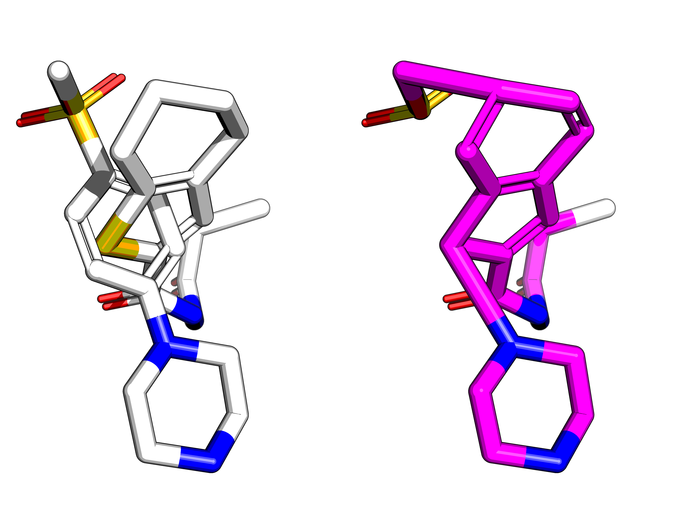

## Predicting new followups

Fragmenstein can also merge fragments and suggest its own 
(cf. [Moonshot result](https://discuss.postera.ai/t/fragmenstein-merging/1461)).

The method `Victor.combine` does this.

## Merging

The merging uses a 2 Å positional overlap mapping with the rings collapsed and subsequently expanded
and re-bonded by proximity with several corrections done for corner cases.

## Valence

The class `Rectifier` attempts to fix the various issues that may have arisen.
Generally cases when the merger results in a valence that is higher than the element supports.
If so, the atom is shifted leftwards (and upwards) on the periodic table or the bond order is lowered.

## Warhead harmonisation

A issue arises merging different warheads. In which case they can be ignore, kept or the first warhead used.
Bonding to a warhead is forbidden.
Therefore, mergers may link up in unexpected ways, such as this, wherein two hits actually have different warheads.

## Mad ones
If two rings intersect perpendicularly (_e.g._ `x0708-x2193`) the resulting bonding will be unexpected ("emergency bonding" warning appears).

I have no idea how to resolve this.
