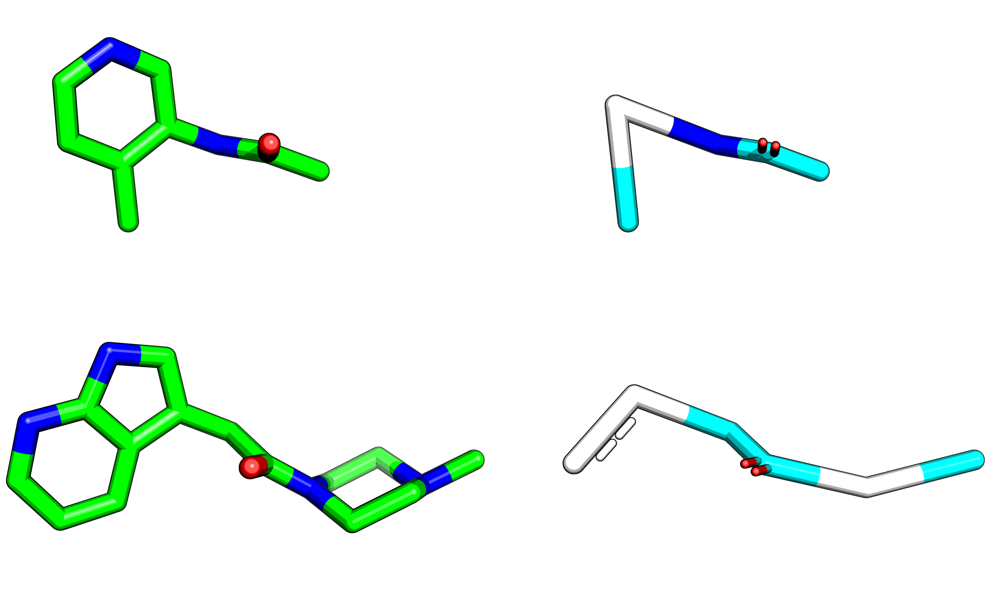

## Predicting new followups

Fragmenstein can also merge fragments and suggest its own 
(cf. [Moonshot result](https://discuss.postera.ai/t/fragmenstein-merging/1461)).

The method `Victor.combine` does this.

## Merging

The merging uses a 2 Å positional overlap mapping with the rings collapsed and subsequently expanded
and re-bonded by proximity with several corrections done for corner cases.

## Ring collapse

This is a seemingly "simple" solution to avoid weird bonding issues —overlaps of 5-rings with 6-rings, perpendicular rings, etc.

What happens is that all rings are replaced with a single atom that can be unpacked later.

``Ring`` class in ``core._collapse_ring`` does exactly that (inherited by ``Frankenstein``).

But it can be a bit unpredictable in the upacking step after merging,
therefore it is not implemented in Victor with SMILES
—although using full merge mode is inferior to permissive unmerged mode anyway.
Instead, 

* `.collapse_ring(mol)`
* `.expand_ring(mol)`

There are two ways. remembering the bonds or making new ones by proximity for the rings.
The latter is a lot better for most cases as the rings are never 100% overlapping.

## Logging

> Depracation of `Fragmenstein.notebook` (txt dict for debug) in favour of `Victor.journal` (proper logging)

The correct logging is via Victor's journal. The logging log `Fragmenstein`.
However, Fragmenstein has `.logbook` which are more debug notes —dictionary. These should be integrated or removed.

## Valence

The class `Rectifier` attempts to fix the various issues that may have arisen.
Generally cases when the merger results in a valence that is higher than the element supports.
If so, the atom is shifted leftwards (and upwards) on the periodic table or the bond order is lowered.

## Warhead harmonisation

A issue arises merging different warheads. In which case they can be ignore, kept or the first warhead used.
Bonding to a warhead is forbidden.
Therefore, mergers may link up in unexpected ways, such as this, wherein two hits actually have different warheads.

## Mad ones
If two rings intersect perpendicularly (_e.g._ `x0708-x2193`) the resulting bonding will be unexpected
("emergency bonding" warning appears).

I have no idea how to resolve this or whether it should be.

NB. Spiro compounds are tolerated.

## Fused rings

Even though azetine-benzene, cyclopropane-benzene and bridged compounds are chemically possible,
these are corrected as they are unlikely to be intended. As a result bridges will be removed
and for rings of size 3/4 will become 5.

## Allenes

Additionally, are forbidden.

## Code caveat

The code currently has many ring corrections in 'collapse ring' class (expansion part),
while bond order corrections are in 'rectifier'.
Ideally these should be merged...