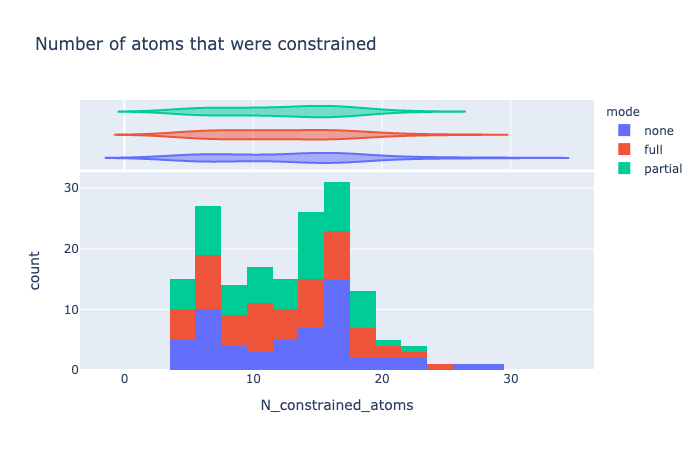
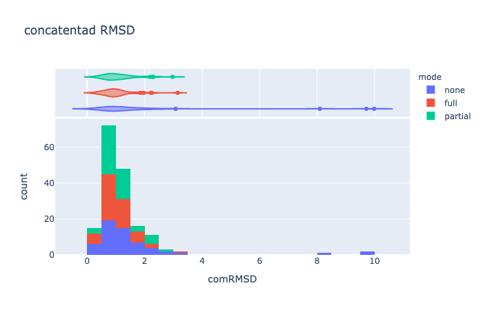
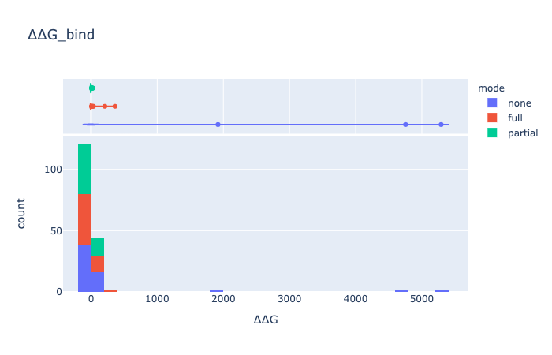
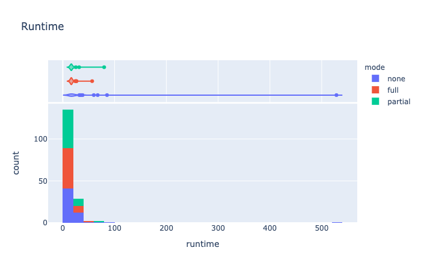
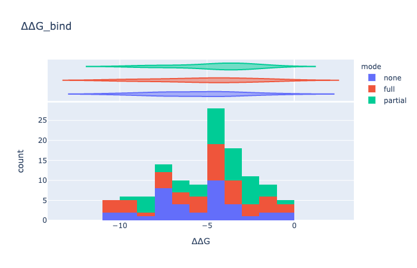
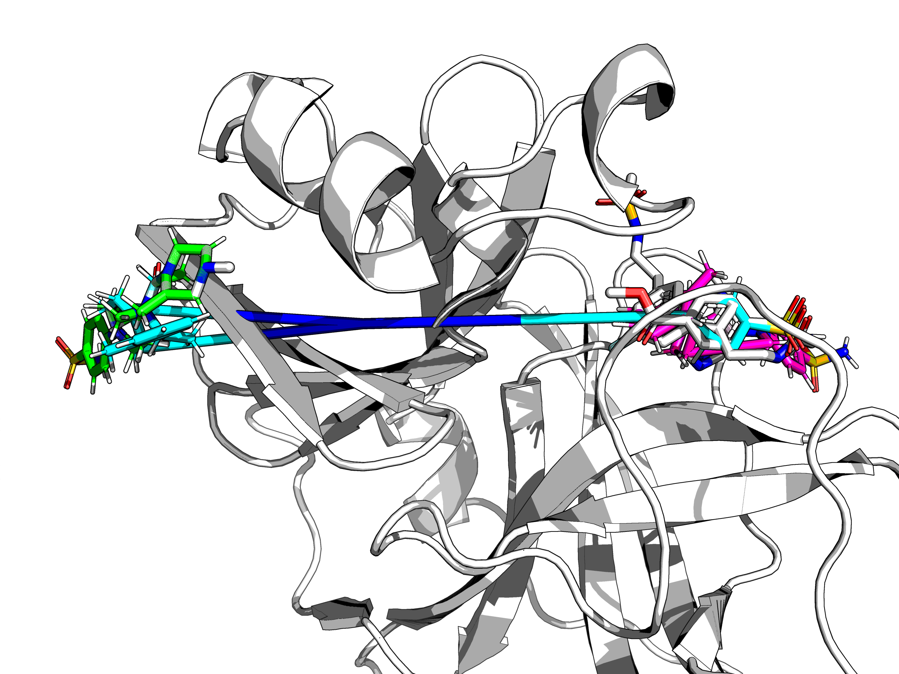

## Three modes

As [discussed](readme.md), it has three main parts:
* the pipeline (Victor class)
* the minimiser (Egor class) and
* the followup placing algorithm (Fragmenstein class)

The latter has three modes as discussed in [fragmenstein.md](fragmenstein.md): "full-merging", "partial-merging" and "no-merging" for mapping.

Each has advantages and disadvantage. For the [covid](covid.md) data, an analysis was done to figure out which.

50 followups were randomly chosen and placed with the three modes (170 were done for safety).

The medians of the various scores are:

| mode    |      ∆∆G [kcal/mol] |   concatenated RMSD [Å] |   Number of constrained atoms |   Runtime [s] |
|:--------|---------:|----------:|----------------------:|----------:|
| full    | -3.55336 |  0.940974 |                    12 |   16.6215 |
| none    | -4.02654 |  1.0435   |                    14 |   17.5834 |
| partial | -3.23976 |  0.970151 |                    13 |   16.7117 |

No merging mapping is better for both number of atoms used and the ∆∆G_bind.
It scored worse for time and slightly for RMSD.

It is clear that the no merging mapping when it fails it fails badly.
So let's look solely at all ∆∆G < 0 ones:

The outliers in ∆∆G are caused by erroneous hits being claimed to be inspirations.
Here is one of these, WAR-XCH-b6889685-63 in the same colours as the graphs:

Namely the outlier is chosen as an inspiration and the bond length is not violated as the atoms from the mapped parts are 
not neighbours, so the 3 Å limit does not apply. Curiously, full-merger mapped to one cluster, while partial merger to the loner.

