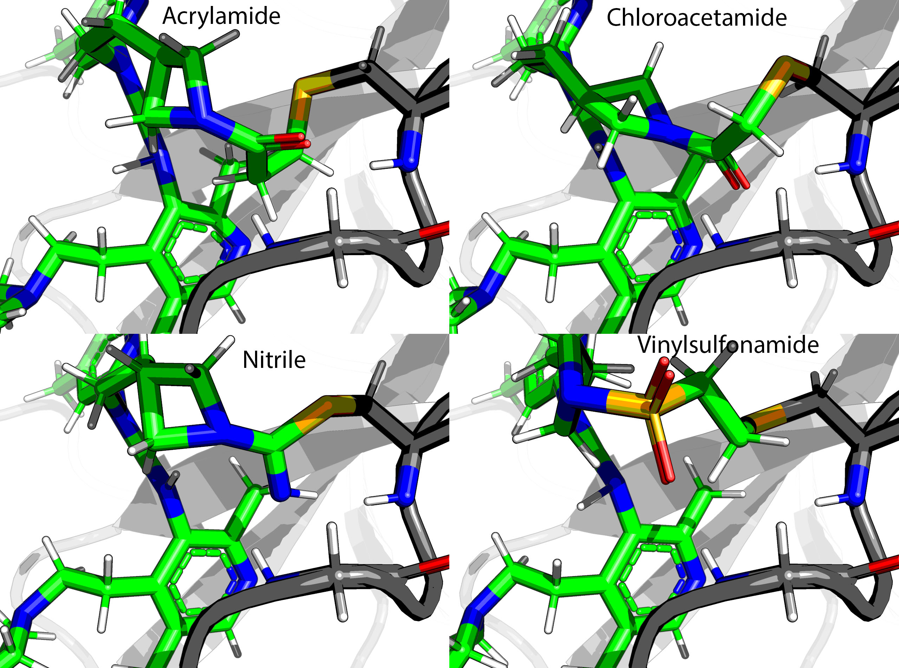

# Victor

Victor is a pipeline class. This has many features and is rather complicated in its setup: but then a point and click
solution that works universally is a bad solution.
Here is a real world usage that uses multiple features:

Import pyrosetta and initialised before everything (applies to Igor too):

    import pyrosetta
    pyrosetta.init(extra_options='-no_optH false -mute all -ignore_unrecognized_res true -load_PDB_components false')
    from fragmenstein import Igor, Fragmenstein, Victor
    import logging, csv, json
    from rdkit import Chem
    from rdkit.Chem import AllChem
    
configure whither to save and whence to load:

    Victor.work_path = '../Mpro_fragmenstein'
    Victor.enable_stdout(logging.WARNING)
    mpro_folder = '/Users/matteo/Coding/rosettaOps/Mpro'  
    
    def get_mol(xnumber):
        mol = Chem.MolFromMolFile(f'{mpro_folder}/Mpro-{xnumber}_0/Mpro-{xnumber}_0.mol')
        mol.SetProp('_Name', xnumber)
        return mol
    
alternatively `Victor.enable_logfile('reanimate.log',logging.DEBUG)`
    
add extra constraints that are warhead & protein specific.
note that the warhead definitions contain preferred names for the connecting atoms and their neighbours

    for cname, con in [('chloroacetamide', 'AtomPair  H  145A  OY  1B HARMONIC 2.1 0.2\n'),
                      ('nitrile', 'AtomPair  H  145A  NX  1B HARMONIC 2.1 0.2\n'),
                      ('acrylamide', 'AtomPair  H  143A  OZ  1B HARMONIC 2.1 0.2\n'),
                      ('vinylsulfonamide', 'AtomPair  H  143A  OZ1 1B HARMONIC 2.1 0.2\n')
                      ]:
        Victor.add_constraint_to_warhead(name=cname, constraint=con)
        
Here is the definition of a nitrile warhead, for example:

    {'name': 'nitrile',
    'covalent': 'C(=N)*',  # zeroth atom is attached to the rest
    'covalent_atomnames': ['CX', 'NX', 'CONN1'],
    'noncovalent': 'C(#N)',  # zeroth atom is attached to the rest
    'noncovalent_atomnames': ['CX', 'NX']
    }
    
This allows warheads to be mixed and matched.

The choice of the protein template is a bit weak.
I plan to experiment with minimisation against averaged electron densities.
    
    def get_best(hit_codes):
        return Victor.closest_hit(pdb_filenames=[f'{mpro_folder}/Mpro-{i}_0/Mpro-{i}_0_bound.pdb' for i in hit_codes],
                            target_resi=145,
                            target_chain='A',
                            target_atomname='SG',
                            ligand_resn='LIG')
    
There is a change I require to the pose
    
    def pose_fx(pose):
            pose2pdb = pose.pdb_info().pdb2pose
            r = pose2pdb(res=41, chain='A')
            MutateResidue = pyrosetta.rosetta.protocols.simple_moves.MutateResidue
            MutateResidue(target=r, new_res='HIS').apply(pose)
    
Define all the steps
    
    def reanimate(smiles, name, hit_codes):
        hits = [get_mol(i) for i in hit_codes]
        best_hit = get_best(hit_codes)
        Victor.journal.debug(f'{name} - best hit as starting is {best_hit}')
        apo = best_hit.replace('_bound', '_apo-desolv')
        print(f'reanimate(smiles="{smiles}", name="{name}", hit_codes={hit_codes})')
        reanimator = Victor(smiles=smiles,
                            hits=hits,
                            pdb_filename=apo,
                            long_name=name,
                            ligand_resn='LIG',
                            ligand_resi='1B',
                            covalent_resn='CYS', covalent_resi='145A',
                            extra_constraint='AtomPair  SG  145A  NE2  41A HARMONIC 3.5 0.2\n',
                            pose_fx = pose_fx
                            )
        return reanimator
     
Read the data and do all warhead combinations if covalent. This data is actually from
[github.com/postera-ai/COVID_moonshot_submissions](https://github.com/postera-ai/COVID_moonshot_submissions).
       
    data = csv.DictReader(open('../COVID_moonshot_submissions/covid_submissions_all_info.csv'))
    
    issue = []
    
    for row in data:
        if row['covalent_warhead'] == 'False':
            pass
            reanimate(name = row['CID'], hit_codes = row['fragments'].split(','), smiles=row['SMILES'])
        else:
            print(f'Covalent: {row["CID"]}')
            for category in ('acrylamide', 'chloroacetamide', 'vinylsulfonamide', 'nitrile'):
                if row[category] == 'True':
                    combinations = Victor.make_all_warhead_combinations(row['SMILES'], category)
                    if combinations is None:
                        issue.append(row["CID"])
                        break
                    for c in combinations:
                        reanimate(name = row['CID']+'-'+c, hit_codes = row['fragments'].split(','), smiles=combinations[c])
                    break
            else:
                print(f'What is {row["CID"]}')
                issue.append(row["CID"])
      
The above could have been customised further, by making a class that inherits Victor and defining
 `post_params_step`, `post_fragmenstein_step`, `pose_mod_step` or `post_igor_step`, which are empty methods
intended to make subclassing Victor easier as these are meant to be overridden
—NB `pose_mod_step` is run if not `pose_fx` is given.