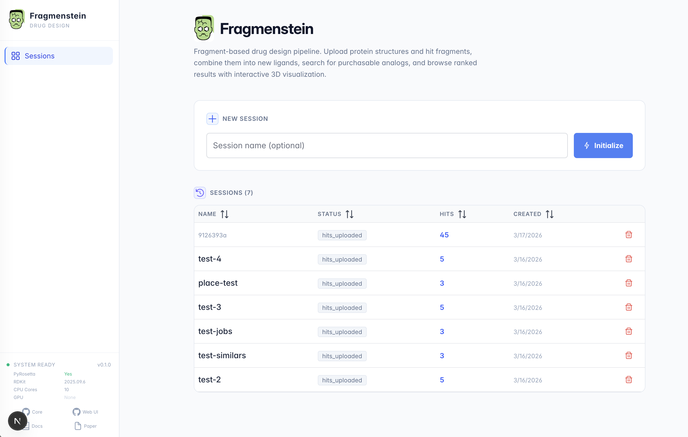
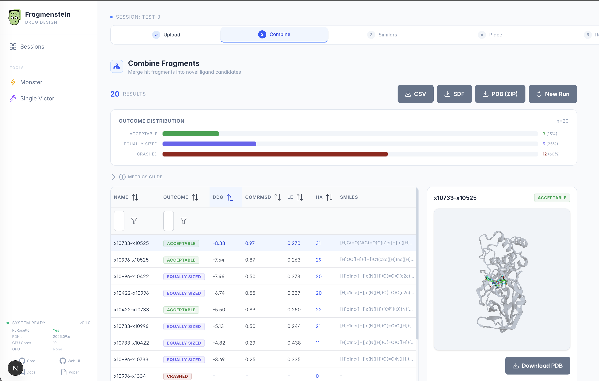

# Fragmenstein Web UI

A browser-based interface for the [Fragmenstein](https://github.com/matteoferla/Fragmenstein).





## Quick Start

```bash
cd web
./start.sh
```

Then open **http://localhost:3000** in your browser.

The script will:
- Check that Python and Node.js are installed
- Install any missing dependencies automatically
- Start the backend (port 8000) and frontend (port 3000)

Press **Ctrl+C** to stop.

## What You Can Do

1. **Upload** a template protein (PDB) and hit fragment molecules (SDF/MOL/PDB)
2. **Combine** fragments into new ligand candidates (pairwise merging)
3. **Find analogs** via SmallWorld, PubChem, paste SMILES, or upload a compound library (CSV/Excel)
4. **Place** analogs into the protein binding site
5. **Browse results** with interactive 3D visualization, outcome charts, and CSV/SDF export

## Requirements

- **Python 3.10+** with [Fragmenstein](https://github.com/matteoferla/Fragmenstein) installed
- **Node.js 18+**
- **PyRosetta** (optional, for full energy scoring — without it, use Wictor mode)

## Configuration

| Environment Variable | Default | Description |
|---|---|---|
| `BACKEND_PORT` | 8000 | Backend API port |
| `FRONTEND_PORT` | 3000 | Frontend UI port |
| `FRAG_DATA_DIR` | `./data` | Data storage directory |
| `CHEMSPACE_API_KEY` | — | Optional. Enables ChemSpace analog search |
| `MOLPORT_API_KEY` | — | Optional. Enables MolPort analog search |

